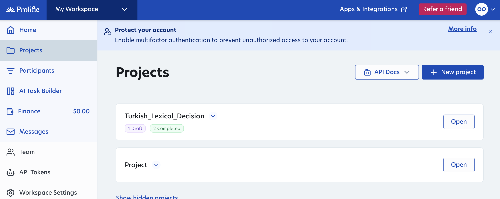
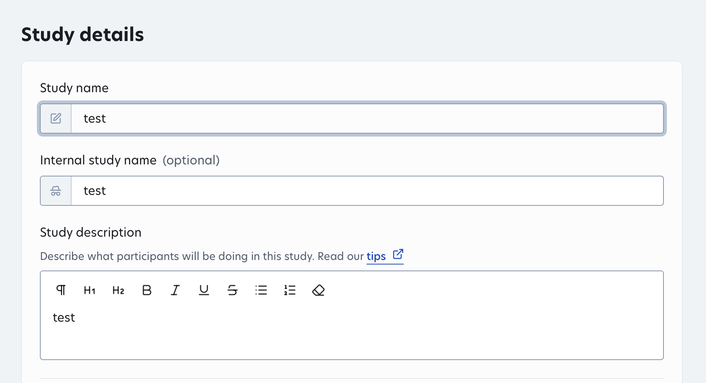
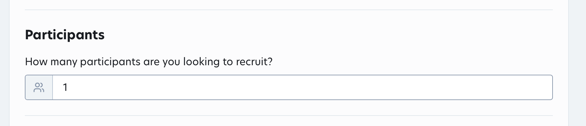
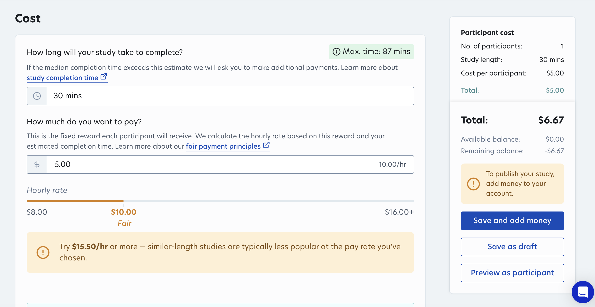
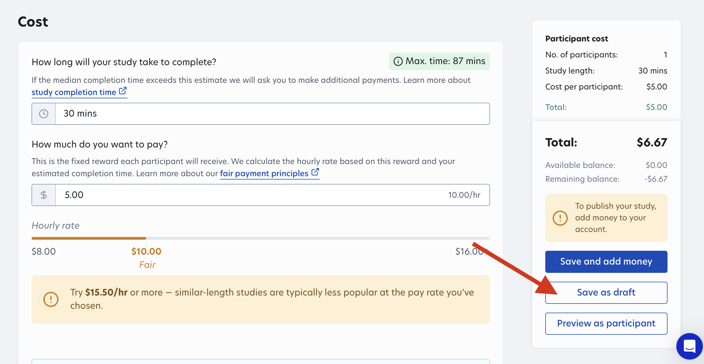
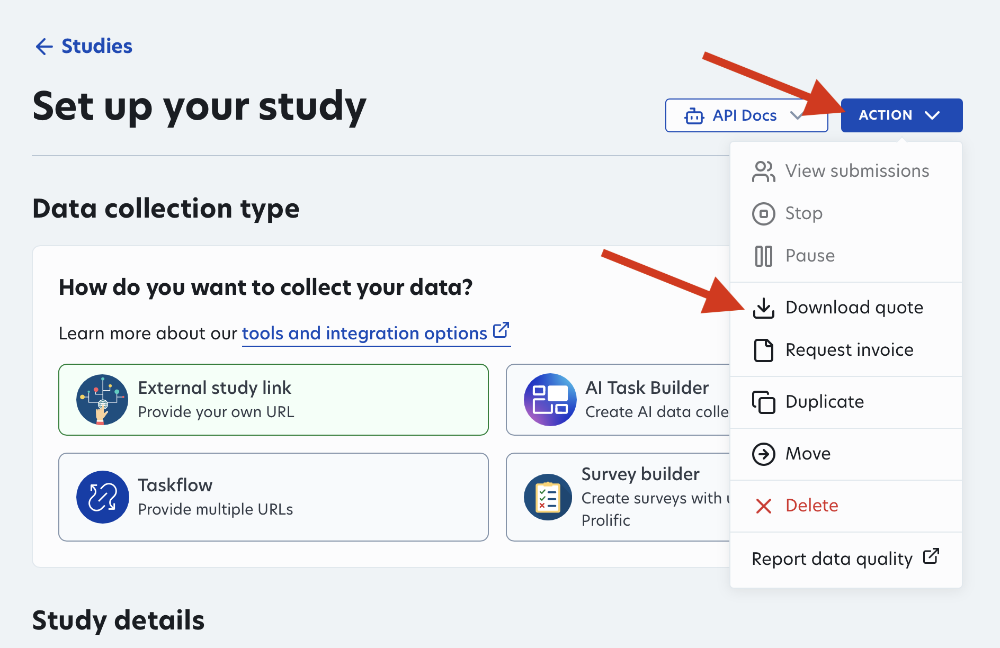

Before you are ready to run participants for your online study on Prolific, you must add money to your account to ensure that you can pay them. We recommend doing this at least a week before you are ready to run your study, to ensure that there is no hold-up. Note that these steps change on occasion, if you have any questions talk to Teresa Leung (Linguistics). 

Summary of Steps:
1. **Submit Prolific Quote**: Create a demo version of the study to have prolific estimate the cost to be sent to Teresa Leung
2. **Create Prolific Invoice**: Create an invoice using the Purchase Order Number provided by Teresa Leung
3. **Money will be uploaded** to your Prolific Account automatically once the invoice is complete

# Steps 

## 1. Submit Prolific Quote

To get a quote for how much your study will cost, you will need:
1. A prolific account
2. The number of participants you wish to recruit
3. The estimated length of your study 

You do NOT need to have the study completely finished. You can create a "demo" study on Prolific with the above information to get the quote and then use the money put into your account to run your real study of the same length afterwards. This is helpful as it sometimes may take a week or two for the money to reach your account (though usually it is faster!). 

## Create a Demo Study 

To create a demo study, go to the *Projects* tab, open a project, and click *Create New Study*. If you don't have a project yet, create a new project as well. 

**Missing creating new study images, you just have create new project ones!!!d**

To generate the quote, you need to fill in all of the fields for the study. Since the demo study will not be published, you can add place-holders in all the fields (including the link for your study). If you accidentally miss a field, when you go to generate the quote, prolific will tell you what you missed. For example, you can write add a study name like: 

## Fill in Payment Info

The only fields that must be filled out accurately are the number of participants, expected study length, and hourly rate. These are used to calculate the total cost of the study. 

Note that for the study length, you should use a fair expected amount of time. We recommend sitting down and timing yourself as you take the study (reading all of the instructions and taking breaks at the allotted breaks) to get a rough estimate. Some participants will be slower and some faster, but all are paid the same flat rate based on the estimated completion time—therefore you want to ensure that you pick a reasonable study length for fair compensation. 

## Generate Quote

To generate the quote, save the demo study you just created as a draft. 

Then at the top of the page, click on *Action* and *Download Quote*. 

**Congrats! You just made the quote!** Send the pdf you just downloaded to Teresa. In your email you need to include:
- The study Quote
- A brief study description along with the number of participants and expected study time
- Where the money for this study will come from (this is usually your advisors research account, but discuss this with your advisor beforehand)
- CC your advisor so that they can approve having this money be transferred from their account (If the money is coming from your Linguistics 5k research fund, you need approval from the DGS rather than your advisor)

## 2. Prolific Invoice

Once your advisor (or DGS) has approved the money, Teresa will generate a *Purchase Order Number* for that amount. 

Once you have that number, open the Invoice page on Prolific, under `Finances > Invoices`:

 

 

The invoice page will open. Fill in the study cost in the first field and the Purchase Order Number in the second. 

You will receive an email with the generated invoice as a pdf. Send that pdf to Teresa. 

# 3. Money will be uploaded

Once the above steps are finished, Teresa will fulfill the invoice. The money should be automatically uploaded to your account in several days. Once it is uploaded, you are ready to run your experiment!