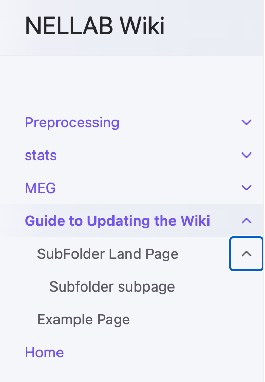
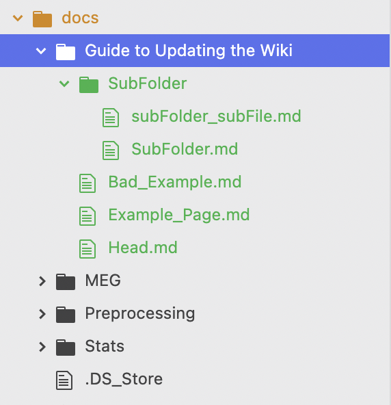

# Guide to updating the wiki
The lab wiki is created using [jekyll](https://jekyllrb.com/docs/installation/macos/), a program that takes markup files and uses specified layouts to create static websites. Using this gives full control over the content and layout of the website while still being able to update it with minimal effort and host it online for free. The website lives as a bunch of code stored on a github repo (currently owned by gituser @StefanPophristic). From the github repo, the website published online using gitpages.

This pages takes you through how to edit the wiki.

## Install prerequisites

In order to update the wiki, you should have the following:
- Github account
- Git installed on your computer
- [Jekyll installed on your computer](https://www.youtube.com/watch?v=WhrU9m82Wm8&list=PLLAZ4kZ9dFpOPV5C5Ay0pHaa0RJFhcmcB&index=2)

## Fork or Clone the repo

You can't make edits to the wiki directly online. This is designed to prevent any edits that you make from being immediately published on the front-facing version of the website (including changes that could potentially lead to a crash!). In order to make edits, you first have to copy over the repo containing all of the wiki code.

There are two ways to do this:
1. [preferred] Directly clone the repository.
2. Fork the repository, then clone it.

**Cloning** a repository copies it from a user's github onto your local computer. Once you have it on your local computer, you can make any edits that you want. Once you make the edits, you **push** and **commit** the local version back to the main version hosted on github. This updates the main version, automatically and immediately publishing the changes to the online wiki! In order to do this, make sure that the current [maintainer of the wiki]({{site.maintainer}}) adds you as a collaborator on the project.

[quick tutorial on cloning, pushing](https://www.youtube.com/watch?v=yxvqLBHZfXk)

**Forking** a repository essentially copies it from one user's github account to your own. Once you do this, you don't need the original users permissions to make any changes, and you can publish your own version of the wiki using gitpages. This is helpful in case you decide you want to make your own personal wiki, or if for some reason the person who is in charge of the wiki is nowhere to be found. If you decide to fork the wiki, and want to add your changes to the original wiki repo, you will have to submit a pull request that is approved by the original owner of the lab wiki.

[Quick tutorial on forking](https://www.youtube.com/watch?v=-9ftoxZ2X9g)


## Making Changes to the wiki

Once you have the repository cloned, you can start making changes to the wiki! Open up the entire repository folder in your favorite text/code editor (e.g. Atom or Visual Studio). You will see that this page is nestled under `docs>Template>Template.md`. To add or edit pages all you have to do is add markdown files with the content you want. Jekyll will compile everything and format it on its own!

All content files are written in markdown and are found in the `docs` folder. This template folder is designed to show you the structure of the folder and files within it. Take a look at the menu bar on the published site, and the folders found inside docs. You will see that each folder corresponds to a tab in the menu:

<center>


</center>

If you want to make a new tab for the website, copy over this template folder, and change the names of the files to whatever you need.

Each markdown file will begin with a preamble that looks something like this:

```
---
layout: default
title: "Subfolder subpage"
parent: "SubFolder Land Page"
grand_parent: "Template"
nav_order: 1
has_children: false
---
```

This preamble tells jekyll how to put all of the pages together.
- **layout**: tells jekyll to apply the normal styling to this page.
- **title**: is the name that will appear in the menu bar for this page.
- **parent**: is the name of the folder directly above the page.
- **nav_order**: is the order in which this file should appear relative to others in the same folder in the navigation bar
- **has_children**: `true` if this page will contain sub-pages

If the `title` field has the name of the folder in which it is (e.g. this page has `title: Guide to Updating the Wiki` and is inside the folder `Guide to Updating the Wiki`), that markdown file will serve as the land page when clicking on that menu tab. In order for the navigation menu to work properly with all of the sub-dependencies, it must contain one such markdown file inside of it.

## Testing changes to the wiki

Before finishing your edits, its important to double check that they look the way you want them to and do not cause any crashes. If you publish a change that causes a crash, it will crash the entire wiki for everyone! If you have jekyll installed, navigate to the folder of the repo in terminal and run the following command:

```
jekyll serve
```
If there are no compiling errors, this will give you an output like this:
```
(base) stefan@Stefans-Air wiki % jekyll serve
Configuration file: /Users/stefan/Desktop/repos/wiki/_config.yml
            Source: /Users/stefan/Desktop/repos/wiki
       Destination: /Users/stefan/Desktop/repos/wiki/_site
 Incremental build: disabled. Enable with --incremental
      Generating...
      Remote Theme: Using theme just-the-docs/just-the-docs
                    done in 1.312 seconds.
 Auto-regeneration: enabled for '/Users/stefan/Desktop/repos/wiki'
    Server address: http://127.0.0.1:4000
  Server running... press ctrl-c to stop.

```

Copy over the url under `Server address` into your local browser, and you will be able to see all of the changes you've made! The cool thing is, if you make more edits with this url open, and refresh the page, they will be immediately reflected! This serves as a sandbox. Nobody can see any changes you make locally, so feel free to experiment and anything you like.

If you are running this command for the first time, do this:
```
bundle exec jekyll serve
```

## Publishing changes

When you are happy with the changes you've made, you need to **push** the changes back into the main repo (and if you forked the repo, submit a pull request). Once the push is accepted, all of the changes will automatically be reflected on the published website.

## Tutorials

This tutorial is a good introduction to the jekyll framework. If you are interested in making any aesthetic changes, or are unsure why there are issues in the wiki (e.g. it is not compiling), I recommend first going through this tutorial before you attempt to make changes:
https://www.youtube.com/watch?v=T1itpPvFWHI&list=PLLAZ4kZ9dFpOPV5C5Ay0pHaa0RJFhcmcB&index=1

The following tutorial covers how to publish the wiki page online via git pages. To keep this centralized, only one lab member should do this at any given moment. However, if you decide to make your own personal website or personal wiki from the lab wiki, you can follow these instructions:
https://www.youtube.com/watch?v=e5AwNU3Y2es
Notes about this tutorial:
- min 1:46: click on "Github Pages Jekyll" for the lab wiki rather than "Static HTML"
- you can ignore everything past 2:44 because we are not paying for a domain name.
