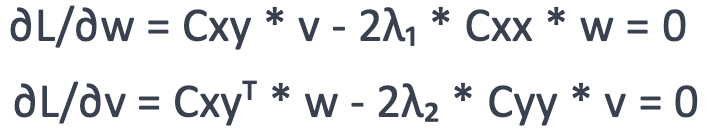
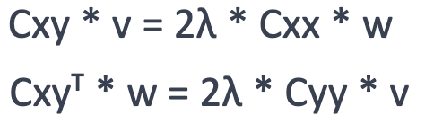

## Table of contents
{: .no_toc .text-delta }

1. TOC
{:toc}

---

# What is Canonical Correlation Analysis?

Canonical correlation analysis (CCA) is a statistical method used to explore the relationships between two sets of multivariate data (called *X* and *Y* from now on). More specifically, it finds a *third space* in which the two sets of data are **maximally correlated**. 

How we do this is by finding a new set of basis vectors for *X* and *Y* such that if we project *X* and *Y* onto these new vectors, the correlation between the two sets of data is maximized. 

### An example

Let's say we are interested in comparing neural activity recorded using MEG to neural activity recording using EEG. We record from 157 MEG sensors and 256 EEG electrodes. Now have two multivariate time series - but we don't know how those MEG sensors relate to the EEG electrodes. CCA offers a data-driven way to find linear combinations of MEG sensors that are maximally correlated to linear combinations of EEG electrodes and vice versa. 

In this way, CCA is also another [spatial filtering](../Preprocessing/Filtering/SpatialFilering.md) method. Here, CCA would help us to identify shared patterns between MEG and EEG recordings which we probably couldn't observe using standard univariate methods.

# Mathematical Background

We have two sets of multivariate variables:

- *X*: Our MEG recordings (a sensor by timepoint matrix)
- *Y*: Our EEG features (a electrode by timepoint matrix)

Now the goal of CCA is to find pairs of linear combinations of the variables in *X* and *Y* that are maximally correlated. These linear combinations are called **canonical variates**.

We can define:

$$u = X\vec{w}$$ and 

$$n = Y\vec{v}$$

where $u$ and $n$ are the canonical variates and $\vec{w}$ and $\vec{v}$ are the weight vectors for *X* and *Y*, respectively. Essentially, $\vec{w}$ and $\vec{v}$ act as spatial filters for *X* and *Y*, respectively.

The objective is to maximize the correlation between $u$ and $n$. Substituting $u = X\vec{w}$ and $n = Y\vec{v}$, this becomes the following equation:

$$ \max \vec{w}^T*C_{XY}*\vec{v}$$

with the constraint that the canonical variates **u** and **n** have unit variance:

$$\vec{w}^T*C_{XX}*\vec{w}=1$$

$$\vec{v}^T*C_{YY}*\vec{v}=1$$

These constraints are to make sure that our weights to not go up to infinity. The equations above simply mean that we want to normalize each data's covariance matrix such that it equals 1. 

where:

- $C_{XX}$ is the covariance matrix of *X*
- $C_{YY}$ is the covariance matrix of *Y*
- $C_{XY}$  is the cross-covariance matrix between *X* and *Y*

These constraints also prevent trivial solutions (e.g., setting $\vec{w}$ and $\vec{v}$  to zero) or solutions that are arbitrarily scaled.

The objective function now can be written using Lagrangian multipliers, where we maximize the covariance between **u** and **n** while keeping the variances of **u** and **n** fixed to 1. Effectively maximizing the normalized covariance, i.e. correlation.

$$ L( \vec{w}, \vec{v},\lambda_1, \lambda_2) = \vec{w}^T*C_{XY}* \vec{v}- \lambda_1* (\vec{w}^T*C_{XX}* \vec{w}-1)-\lambda_2*(\vec{v}^T*C_{YY}* \vec{v}-1)$$

where $\lambda_1$ and $\lambda_2$ are the Lagrangian multipliers enforcing the unit variance constraint for **u** and **n**, respectively.

We can then simplify the above equation down to a very simple eigenvalue decomposition (which is covered in the [PCA](../Preprocessing/Filtering/SpatialFiltering.md#PCA) section) where:

$$ A = C_{XX}^{-1} * C_{XY} * C_{YY}^{-1} * C_{XY}^T $$

and 

$$A\vec{w} = 2\lambda^2\vec{w}$$

### The full derivation

If you're interested in the full derivation, here it is: 

<details>
  <summary> **The full derivation** </summary>
   
We can now take the derivatives of the Lagrangian with respect to **w**, **v**, **λ<sub>1</sub>** and **λ<sub>1</sub>** and set them to zero:



This simplifies to:



Now we can substitute for ****v**:


And rearrange:


This simplifies to:


Now we can substitute for ****v**:


And rearrange:


We can use matrix multiplication to compute:

$$ A = C_{XX}^{-1} * C_{XY} * C_{YY}^{-1} * C_{XY}^T $$

And then solve the eigenvalue problem using eigenvalue decomposition:

$$A\vec{w} = 2\lambda^2\vec{w}$$

Which will give us the canonical weights **w**.

We can repeat the same steps and subsitute for **w** to solve for **v**.

Now we can compute the canonical variates **u = Xw** and **n = Yv**.

</details>

----

# Implementation

There are implementations for CCA in [Python](https://scikit-learn.org/stable/modules/generated/sklearn.cross_decomposition.CCA.html) and [MATLAB](https://www.mathworks.com/help/stats/canoncorr.html)

However, you can also use this custom function and implement it yourself!

```python
def compute_weights(Cxx, Cyy, Cxy, f, gamma=None):
    """
    Computes the weights w_x and w_y for Dimension f such that w_x*Data_x is maximally
    correlated with Data_y * w_y, while keeping the correlation between
    w_x*Data_Shuffled and Data_y*w_y at zero.

    Parameters:
    Cxx : ndarray
        Covariance matrix of data at time X
    Cyy : ndarray
        Covariance matrix of data at time Y
    Cxy : ndarray
        Covariance matrix between data at time X and Y
    f : int
        Dimension
    gamma : float, optional
        Regularization parameter

    Returns:
    w_x : ndarray
        Weights for data at time X
    w_y : ndarray
        Weights for data at time Y
    r : ndarray, optional
        Correlation coefficients
    """
    if gamma is not None:
        I = np.eye(Cxx.shape[0])
        Cxx = (1 - gamma) * Cxx + gamma * I * np.trace(Cxx)
        I = np.eye(Cyy.shape[0])
        Cyy = (1 - gamma) * Cyy + gamma * I * np.trace(Cyy)
        # Cxy = (1 - gamma) * Cxy + gamma * I * np.trace(Cxy)

    D, w_x = eigh(Cxy @ np.linalg.inv(Cyy) @ Cxy.T, Cxx, subset_by_index=(Cxx.shape[0] - f, Cxx.shape[0] - 1))
    _, w_y = eigh(Cxy.T @ np.linalg.inv(Cxx) @ Cxy, Cyy, subset_by_index=(Cyy.shape[0] - f, Cyy.shape[0] - 1))

    w_x = w_x[:, ::-1]
    w_y = w_y[:, ::-1]

    
    # Fix to positive correlations
    for idx in range(f):
        if np.dot(w_x[:, idx].T, np.dot(Cxy, w_y[:, idx])) < 0:
            w_x[:, idx] = -w_x[:, idx]
    r = np.sqrt(D[::-1])
    
    return w_x, w_y, r

```

## Sample pipeline
Using the data from **Group B** again, let's look at what a sample analysis pipeline would look like. 

### Settings
Activate your analysis environment and import useful packages:

```python
import mne
import matplotlib as plt
import os
import numpy as np
from sklearn.decomposition import PCA
from mne.decoding import UnsupervisedSpatialFilter

%matplotlib qt
```

Define useful directories, load in and filter raw data:

```python
group = "GroupB"
PATH = f'/Volumes/Server/SHARED/Methods meetings/Fall 2024 Methods Meetings/Course_Project/MEG_data/{group}/Recording'

# set a directory where you'll save all your files
meg_dir = "/Volumes/Server/NEUROLING/PersonalFiles/Aline-Priscillia Messi/megmethods"
subj = "R2470"

# load in raw
raw = mne.io.read_raw_fif(PATH+f'/{subj}_EventModel_9.26.24_NR_raw.fif', preload=True)

raw_filt = raw.filter(1,40)
```

### Interim preprocessing
Assuming you've cleaned your data, removed bad channels and interpolated them, we need to reduce the size of our data before running it through our script. 

This is commonly done through downsampling and applying PCA to the data. 

```python
# downsample at 500hz 
downsampled = raw_filt.resample(sfreq=500)

# extract the data
X = downsampled(copy=False)

# define our PCA object
n_components = 50
pca = UnsupervisedSpatialFilter(PCA(n_components), average=False)

# apply PCA to data
pca_data = pca.fit_transform(X)
```
Our data here has the shape: n\_trials x n\_components x n\_timepoints. 
Next we're going to simulate another dataset that is going to be the size of a 32-channel EEG dataset. The code is hidden here because it isn't important. 

You could replace it with word embeddings, another EEG dataset, a matrix of relevant behavioral data etc...

<details>
  <summary> Simulate 32-channel EEG data </summary>

```python
# Parameters
n_trials = 2029
n_channels = 32
n_timepoints = 475
fs = 500  

# Create time vector
time = np.linspace(0, n_timepoints / fs, n_timepoints)

# Simulate EEG data
# Start with random noise
eeg_data = np.random.normal(0, 1, (n_trials, n_channels, n_timepoints))

# Add a sinusoidal component for some channels to simulate brain activity
freqs = [10, 20]  # Example frequencies (alpha and beta bands)
amplitude = 5  # Amplitude of oscillations
for trial in range(n_trials):
    for ch in range(n_channels):
        if ch % 2 == 0:  # Add oscillations to even-numbered channels
            eeg_data[trial, ch, :] += amplitude * np.sin(2 * np.pi * freqs[ch % 2] * time)

# Normalize the dataset
eeg_data = (eeg_data - np.mean(eeg_data)) / np.std(eeg_data)
```
</details>

Our data although reduced to 50 components instead of 157 channels still has too much going on. Traditionally, we would use cross-validation (and a sliding timewindow) to determine our canonical variates but for this example we'll just compute them after averaging both datasets. 

What's important here is that the number of trials is the same across both datasets!

```python
# average both datasets over time
eeg_data = np.mean(eeg_data, axis=2)
pca_data = np.mean(pca_data, axis=2)

# Center the data
centered_meg = pca_data - np.mean(pca_data, axis=0)
centered_eeg = eeg_data - np.mean(eeg_data, axis=0)
                        
# Compute covariances
Cmeg = np.cov(centered_meg, rowvar=False)
Ceeg = np.cov(centered_eeg, rowvar=False)
                        
# Manually compute the cross-covariance
n_obs = centered_meg.shape[0]
Cem = np.dot(centered_meg.T, centered_eeg) / n_obs
```

And now all we have to do is use our custom function!

```python                      
# Compute canonical components            
Wx,Wy, r = compute_weights(Cmeg, Ceeg, Cem, 10)

```


