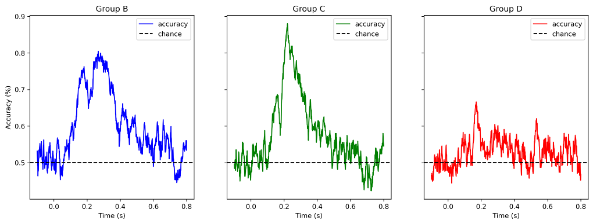
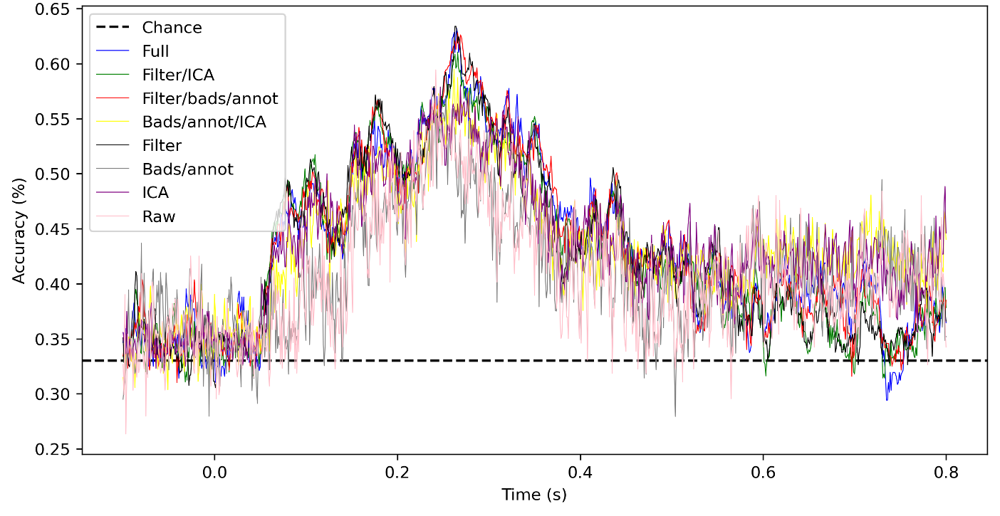

# Decoding

## What is decoding?

Put very simply, decoding refers to the process of predicting the stimuli presented to participants. This is done by training a classifier (more on this below) to discriminate between the different categories using one set of neural data and testing its performance on a (typically different) set of neural data.

Why is decoding an interesting tool? The ability of a classifier to correctly classify an input as, e.g., A or B tells us something about how a given stimulus is represented neurally in time and/or space. If decoding is successful, this allows us to say something about how a given variable is encoded in neural activity. Finally, decoding takes into account fine-grained patterns in the data, thus setting is apart from traditional univariate analyses which typically averages out such fine-grained patterns.

## Overview of the decoding process

1. Collect data and preprocess it (more on this below)

2. Potentially reduce the data dimensionality.

3. Construct your model by specifying parameters such as type of classifier (see below), number of cross-validations (see below), and number of max iterations (i.e., how long the model should try to update its parameters during the training process before stopping).

4. Fit your model to the data for a participant and plot the mean accuracies across the different folds. The result of classifying three participants' data will look something like this—note how decoding accuracies vary across participants:



5. Average accuracy scores across participants and perform stats on them, e.g., cluster-based permutation tests.

## Preprocessing: How much or how little?

Grootswagers et al. (2017) state the following:

'As classifiers have the capacity to learn to ignore bad channels or suppress noise during training, artifact correction is likely less critical in decoding analyses.'

As such, it might be worth playing around with the amount of preprocessing that you do to see what makes sense in the case of your particular experiment. The image below illustrates decoding performance of a classifier using different combinations of preprocessing steps (Filter: 1-40Hz bandpass filter; Bad/annot: interpolation of bad channels and annotation of noisy segments; ICA: removal of well-characterized components such as heartbeat, blinks, and the iron cross).




## Some of the parameters that can be varied
As with any analysis method, there are a number of parameters you can vary when doing a decoding analysis. As such, there are no right or wrong way to do the analysis—what to do depends on the details of your specific experiment. The following outlines some of the parameters that can be varied, but is by no means exhaustive. See also Grootswagers et al. (2017) for further discussion.

**Reducing the data dimensionality:**
It's often beneficial to reduce the data dimensionality to increase the SNR, decrease computational efficiency, and/or prevent overfitting of the model to the data. There are a number of different ways to reduce the data dimensionality:

- Principle Component Analysis (PCA), i.e., change the data structure so that the 157 MEG channels are reduced to X number of components (specified by you, typically 50 components account for ~98% of the variance)
- Downsampling of the data, e.g., from the typical 1000Hz at acquisition to something smaller like 200Hz.
- A sliding window approach, i.e., classifying on more than one time point.
- Averaging trials belonging to the same exemplar.

**The type of classifier:**
Decoding is also sometimes referred to as classification, which involves using a computational model—a classifier—to distinguish between different classes based on patterns in the data. The primary goal of a classifier is thus to find boundaries that separate the data points belonging to different classes in the feature space.

Possible classifiers include logistic regressions, linear support vector machines (SVMs), linear discriminant analysis (LDA), and more. There are no hard and fast rules for when to choose one classifier over another. However, it is often advantageous to choose simpler models over complex ones when possible, e.g., linear classifiers like logistic regressions and LDA that aim to separate classifiers using lines/hyperplanes. Simpler models might also be faster to train than more complex models, even if it involves a small tradeoff in accuracies.

See Grootswagers et al. (2017) for an extended discussion of different types of classifiers.

**Number of cross-validations:**
When a model is fit to the data, it will specifically be fit to some data and tested on other data. Ideally, this process should be repeated more than once; who knows if the test data is actually truly representative of the data set as a whole or if it is particularly skewed with outliers? It is common to use at least a 5-fold cross-validation. This means that the resulting accuracy is computed as the average taken over five folds.

One can also do leave-one-trial-out validation to assess model performance when trained on an entire dataset with the exception of one exemplar. As with anything, the choice of cross-validation method depends on the experimental design.

## Template script

1. Read in epochs object:
```python
epochs = epochs = mne.read_epochs('path/to/epochs/', preload = True)
```

2. Extract the data from the epochs object (shape: n_epochs, n_channels, n_times) and create integer labels from metadata. If data is PCA'ed, the data is already in the right shape:

```python
X = epochs.get_data()
le = LabelEncoder()
y = le.fit_transform(epochs.metadata.category)
```

3. Create the model; cross-validation should be 5 or more:

```python
base_mdl = LogisticRegressionCV(cv=5, max_iter=1000) # LogisticRegressionCV automatically cross-validates for parameter tuning, but you can use any sklearn model here
clf = make_pipeline(StandardScaler(),  base_mdl) # It's very important to scale the data (i.e., ensure that each channel has a mean of 0 and an SD of 1) as the model is sensitive to the scale of the channels—without scaling, channels with larger magnitudes will dominate the model. Note that anything added in the pipeline is fit to training data only.
time_decod = SlidingEstimator(clf, scoring='accuracy', verbose=False) # Add everything to the SlindingEstimator for decoding over time
```

4. Fit the model and average the scores across folds:

```python
cv_scores = cross_val_multiscore(time_decod, X, y, cv=5, n_jobs=n_jobs, verbose=False)
mean_scores = cv_scores.mean(axis=0)
```

5. Plot the results:

```python
plt.plot(epochs.times, mean_scores, label='accuracy')
plt.axhline(0.5, color='k', linestyle='--', label='chance')
plt.legend()
plt.xlabel('Time (s)')
plt.ylabel('Accuracy (%)')
```

NB: A good sanity check is to ensure that decoding scores are mostly at chance during the baseline (since the stimulus has not yet been presented). Note that chance level will depend on the number of categories you are classifying; if you are doing binary classification, chance is equal to 50%, ternary classification will have a chance level of 33%, etc.

The above template can—and probably should—be modified to fit your particular experiment!

## Acknowledgements
A significant amount of the material on this page—in particular the code—were initially put together by NeLLab alumn Julien Dirani.

## Examples of how decoding has been done in our lab:

Dirani, J., & Pylkkänen, L. (2023). The time course of cross-modal representations of conceptual categories. NeuroImage, 277, 120254. https://doi.org/10.1016/j.neuroimage.2023.120254

Dirani, J., & Pylkkänen, L. (2024). MEG Evidence That Modality-Independent Conceptual Representations Contain Semantic and Visual Features. The Journal of Neuroscience, 44(27), e0326242024. https://doi.org/10.1523/JNEUROSCI.0326-24.2024

Honari-Jahromi, M., Chouinard, B., Blanco-Elorrieta, E., Pylkkänen, L., & Fyshe, A. (2021). Neural representation of words within phrases: Temporal evolution of color-adjectives and object-nouns during simple composition. PLOS ONE, 16(3), e0242754. https://doi.org/10.1371/journal.pone.0242754


## Additional resources:
Grootswagers, T., Wardle, S. G., & Carlson, T. A. (2017). Decoding Dynamic Brain Patterns from Evoked Responses: A Tutorial on Multivariate Pattern Analysis Applied to Time Series Neuroimaging Data. Journal of Cognitive Neuroscience, 29(4), 677–697. https://doi.org/10.1162/jocn_a_01068

King, J.-R., & Dehaene, S. (2014). Characterizing the dynamics of mental representations: The temporal generalization method. Trends in Cognitive Sciences, 18(4), 203–210. https://doi.org/10.1016/j.tics.2014.01.002

Resources from MNE Python:
https://mne.tools/0.16/manual/decoding.html
https://mne.tools/stable/auto_tutorials/machine-learning/50_decoding.html

NeLLab alumn Julien Dirani's Github with some custom functions useful for decoding analyses: https://github.com/jdirani/MEGmvpa

Various YouTube-videos explaining the premise behind some of the classifiers:
- LDA: https://www.youtube.com/watch?v=azXCzI57Yfc&t=59s
- Logistic Regression: https://www.youtube.com/watch?v=yIYKR4sgzI8
