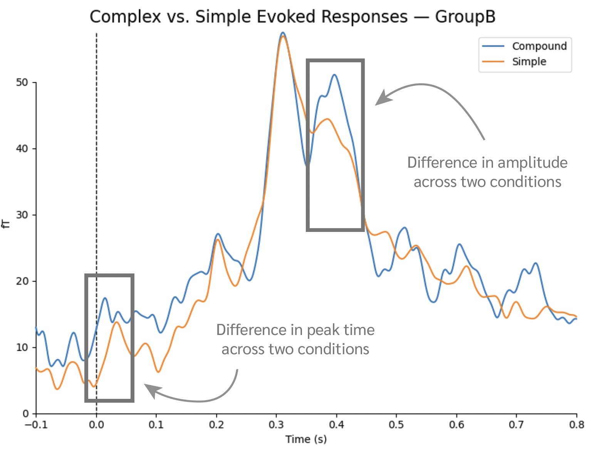
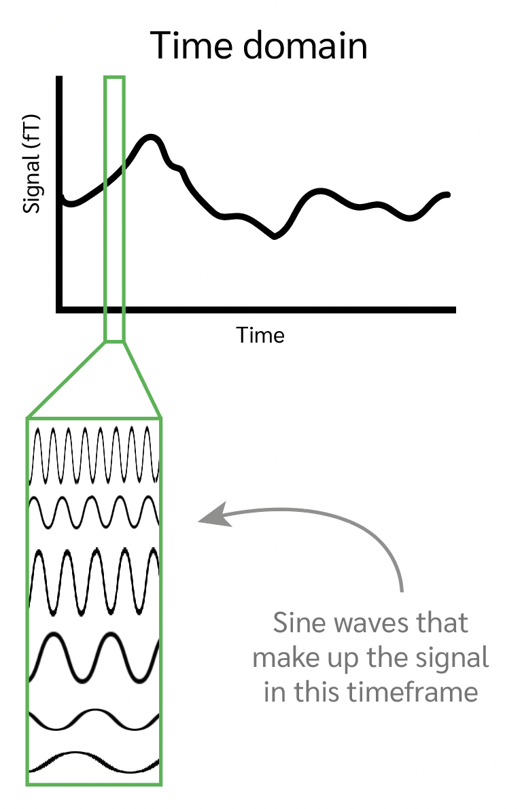
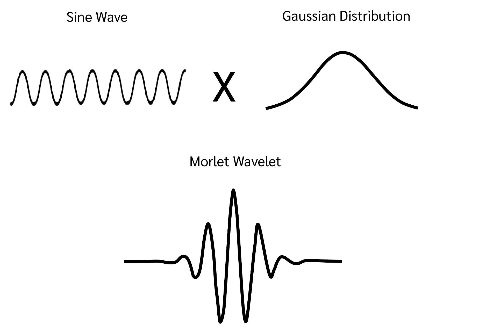
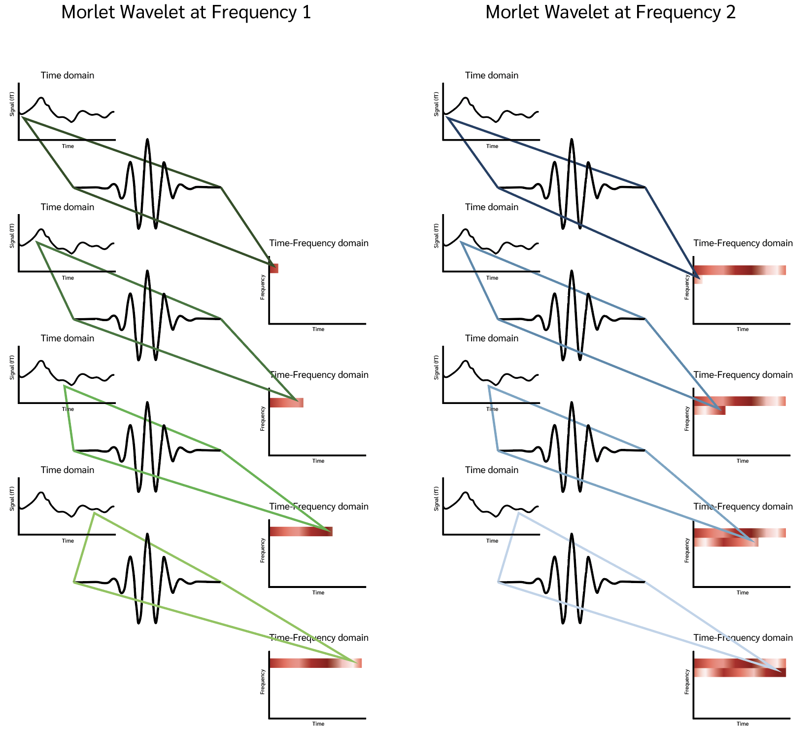

# Overview

In a time domain analysis, you analyze how your signal develops over time. In a frequency domain, you can from which frequencies your signal is composed of. A time-frequency domain analysis mixes these two aspects of your signal together—mapping the power (amplitude squared) of your signal across frequency bands binned into sections of time. 

The standard analysis pipeline in our lab analyses data that looks something like this:



In other words, on the x-axis you have time, and on the y-axis you have either femtoTesla (measure of magnetic activity picked up by the MEG sensors) or dSPM (Dynamic Statistical Parametric Mapping, a source localized noise-normalized value of brain activity). By comparing multiple conditions, you can track different timing of peak activity across conditions or different amplitudes across conditions. These analyses are generally referred to as *ERFs* (Event Related Fields) in the *Time Domain*.

Any neural signal can likewise be modeled by the sum of various sine waves via the Fourier Theorem (the Filtering Methods section covers this, also see the tutorials at the bottom of this). These sine waves can differ along three dimensions: 1) Phase, 2) Frequency, 3) Amplitude.


Rather than focusing on the overall signal, a time frequency analysis focuses on the properties of the sine waves that make up the signal. Are there differences in the frequencies and amplitudes of these sine waves that are correlated with your experimental predictions?

Despite the fact that this analysis focuses on the decomposed signal, it is still analyzing the exact same data. To make an analogy, let's say you ran a behavioral experiment where participants are asked to press a single button when they see a red object, and do nothing when they see a blue object. You only collect a single type of data: at what time point was the button pressed. Despite this simplicity, you can still analyze many aspects of this data: the response time (how quickly was the button pressed after seeing a red object), accuracy (how many mistakes were made), noise of the button presses (was the button pressed at any point prior to stimulus onset?), etc. These different aspects of the data can reveal different effects of your experiment, depending on what your research question is. However, regardless of which aspect of this data you analyze, you are still ultimately analyzing the same button presses. In much the same way, our brain data is a single signal, but analyzing the signal in its simple form, or in its equivalent sine-decomposed form can reveal aspects about the data that can help you answer more questions.

This line of methodologies is relatively new compared to time-domain analyses, so there aren't as many clear linking hypotheses between what changes in power (amplitude squared) of your signal in different frequency bands means. However, this type of analyses has clear benefits as: 1) the link between frequency bands and organization of neurons is easier to study, making a cleaner linking hypothesis between the biology and neural signal; 2) it unpacks the signal in a way that can reveal interesting statistically significant interactions that are washed away in a strictly time-domain analysis.

# Theoretical Overview

To sketch out how a time-frequency domain analysis works in theory, we start with our basic signal:


Using our Fourier theorem, we know that we can represent the exact same data as various sine waves that differ in phase, frequency, and amplitude. For example, the above signal could be decomposed into the following sine waves, each associated with their own frequency:



Frequency is defined as a number of oscillations (peaks and troughs) of a sine wave over time. The result of this is that time and frequency exist in a direction relationship: the more time resolution you have the less frequency resolution you have, and vice versa. Compare the time-domain and frequency-domain plots as extreme examples of this principle. In the time domain, we have all of the time points of our data, but no frequency information. On the other hand, in the frequency domain, we've decomposed our entire signal into sine waves and plotted their relative frequencies. Because the sine waves were defined over the entire time span of our original signal, we are left with a plot with no time information, but very detailed frequency information.

Rather than entirely sacrificing our time information or our frequency information, a time-frequency analysis decomposes the original signal into sine waves within bins of time. By doing so, we loose the time information within each bin, but gain the frequency of each bin. If we define a small time-bind, we still keep a lot of our time information. However, since frequency is defined over time, we will have a much smaller number and less accurate sample of frequencies within that time window. On the other hand, if we define our time bin as large, we loose a lot of the variation in signal that might happen from one time point to the next, but we have a much larger and more accurate sample of frequencies in that time window.


But simply extracting the frequencies of the sine waves that compose your signal is not the full story. Some sine waves may be contributing more to your signal than other sine waves. A direct measure of that is the amplitudes of each of the sine waves. The larger the amplitude, the more that specific sine wave is contributing to your signal (this makes sense if you imagine adding up all of the sine waves to create your original signal, a sine wave with a higher amplitude will contribute more to your final output). Therefore, to quantify this, we plot the **power** (amplitude squared) of each sine-wave frequency over each time-bin.


There are several methods for moving between the Time-Domain and Time-Frequency Domain, each with its own considerations. Some of the most popular ones are reviewed below.

## Short-time Fourier Transform

This method is conceptually the closest to how Time-Frequency was described above. You bin your data into snippets of time, and conduct a fast Fourier Transform (FFT) on each of the bins.

Sharp cut-offs at the start and end of each time window create artificial jumps in the signal, from any amplitude to 0. When performing a short-time FFT, these jumps can cause edge artifacts—artificial peaks in power spectra at the start and end of each time-bin. For more detail on edge artifacts, [this tutorial](https://www.youtube.com/watch?v=9j_FoEFJqV0) is helpful.

In order to avoid edge artifacts, you should taper, i.e. "muffle", the data at each edge of your time-window. Common tapers are Hann (Hanning), Hamming, and Gaussian—though the Hann taper is recommended as it tapers the edges all the way to 0, ensuring no edge artifacats. Because tapering gets rid of some of your data at the edges of each time bin, it is generally recommended to have large time bins if using a short-time FFT. This effect can also be mitigated using temporally overlapping segments.

Tutorials:
- [Analyzing Neural Time Series, Chapter 15](https://search.library.nyu.edu/discovery/fulldisplay?docid=alma990039874450107876&context=L&vid=01NYU_INST:NYU&lang=en&search_scope=CI_NYU_CONSORTIA&adaptor=Local%20Search%20Engine&tab=Unified_Slot&query=any,contains,analyzing%20neural%20time%20series)
- [Mike Cohen Youtube Tutorial](https://www.youtube.com/watch?v=T9x2rvdhaIE)

## Morlet Wavelet

Another way to move into the Time-Frequency domain is to convolve your signal with a morlet wavelet. Although conceptually a little more complicated, this method has two advantages over the short-time FFT: 1) because convolutions are continuous, they side-step the issue of edge artifacts; and 2) due to the complex formulation of a morlet wavelet, this method allows you to extract and analyze in-phase and out-of-phase parts of your signal at the same time.

The basis of this method is a convolution, or computing the dot-product of every time point of your signal with a kernel, in this case the morlet wavelet. Conceptually, a convolution can be thought of as creating an output signal that represents two things: 1) the input **weighted** by the kernel; and 2) how much the input and the kernel have in common. If you are unfamiliar with a convolution the following resources are helpful:

- [Analyzing Neural Time Series, Chapter 10](https://search.library.nyu.edu/discovery/fulldisplay?docid=alma990039874450107876&context=L&vid=01NYU_INST:NYU&lang=en&search_scope=CI_NYU_CONSORTIA&adaptor=Local%20Search%20Engine&tab=Unified_Slot&query=any,contains,analyzing%20neural%20time%20series)
- [3Blue1Brown Youtube Tutorial](https://www.youtube.com/watch?v=KuXjwB4LzSA)

A morlet wavelet analysis is a signal that is convolved with a morlet wavelet. A morlet wavelet is a function defined by multiplying a sine-wave and the gaussian distribution.



Due its composition, this wavelet contains many properties that are helpful in a time-frequency domain. The first, and most important one, is that every Morlet wavelet is made out of a sine wave with a specific frequency. By convolving our signal with that wavelet, the result will be a signal attenuated by the frequency of the wavelet. In other words, the result will be a representation of how much our signal can be explained by a specific frequency. We can then convolve our signal with multiple wavelets that differ in frequencies, resulting in a representation of how much of the signal consists of each frequency.



Like in the short-time FFT, we are loosing time-domain resolution when presenting frequency-domain information. However, because we are convolving with a distribution with **gaussian** properties continuously over time, we are smoothing over all of the time points of our data—resulting in a much smoother representation of the power (amplitude squared) of each frequency per time point.

A final property about morlet wavelets is that they are often represented as a complex number—with a real and imaginary part. The real part represents power of frequencies of sine waves that are in-phase whereas the imaginary part represents power of frequencies of sine waves that are out-of-phase. This property of the convolution is more relevant for phase-coherence analyses which are not covered here.

Running a Morlet-Wavelet convolution in MNE python is incredibly simple, and can be achieved with the following lines of code:

```
# Define frequencies for all morlet wavelets
freqs = np.arange(0.5, 4, 0.2)

# Define number of cycles
n_cycles = freqs / 2

# Apply Morlet wavelet transform (time-frequency analysis)
power = mne.time_frequency.tfr_morlet(
    data,
    freqs=freqs,
    n_cycles=n_cycles,
    return_itc=False,
    n_jobs=1
)
```

A Morlet wavelet is always made by multiplying a Gaussian distribution with a Sine wave. The Gaussian distribution is always the same. So the above parameters are used to define the sine-wave. `freqs` is an array that defines the frequencies for each sine-wave that will create a distinct Morlet wavelet. The above code will create Morlet wavelets for frequencies: 0.5, 0.7, 0.9, 1.1, 1.3, .. 4.0. `n_cycles` defines the number of cycles each of the sine-waves will be (i.e. the length of the sine wave). Finally, the `mne.time_frequency.tfr_morlet()` function takes in these parameters, creates the corresponding Morlet wavelets, and convolves your data with each wavelet.

You can convolve your entire data, each epoch individually, or an average of all epochs in a condition. However, note that convolving on the average of all epochs in a condition will cancel out any out-of-phase data from the result.

Tutorials:
- [Analyzing Neural Time Series, Chapter 12-13](https://search.library.nyu.edu/discovery/fulldisplay?docid=alma990039874450107876&context=L&vid=01NYU_INST:NYU&lang=en&search_scope=CI_NYU_CONSORTIA&adaptor=Local%20Search%20Engine&tab=Unified_Slot&query=any,contains,analyzing%20neural%20time%20series)
- [Mike Cohen Youtube Tutorial](https://www.youtube.com/watch?v=wgRgodvU_Ms&list=PLn0OLiymPak2G__qvavn3T8k7R8ssKxVr&index=2)


## Other Methods

There are other methods that you can use to turn your time-domain data to a time-frequency domain. Another popular one is a Hilbert-Transform and Bandpass-filtering or Multitapers. You can find relevant resources below.

Tutorials:
- [Analyzing Neural Time Series, Chapter 14: Bandpass Filtering and the Hilbert Transform](https://search.library.nyu.edu/discovery/fulldisplay?docid=alma990039874450107876&context=L&vid=01NYU_INST:NYU&lang=en&search_scope=CI_NYU_CONSORTIA&adaptor=Local%20Search%20Engine&tab=Unified_Slot&query=any,contains,analyzing%20neural%20time%20series)
- [Analyzing Neural Time Series, Chapter 16: Multitapers](https://search.library.nyu.edu/discovery/fulldisplay?docid=alma990039874450107876&context=L&vid=01NYU_INST:NYU&lang=en&search_scope=CI_NYU_CONSORTIA&adaptor=Local%20Search%20Engine&tab=Unified_Slot&query=any,contains,analyzing%20neural%20time%20series)
- [Analyzing Neural Time Series, Chapter 17: Less Commonly Used Time Frequency Decomposition Methods](https://search.library.nyu.edu/discovery/fulldisplay?docid=alma990039874450107876&context=L&vid=01NYU_INST:NYU&lang=en&search_scope=CI_NYU_CONSORTIA&adaptor=Local%20Search%20Engine&tab=Unified_Slot&query=any,contains,analyzing%20neural%20time%20series)

# Things to consider

Baseline filtering is important when doing any kind of Time-Frequency analysis. In general, a non-linear baseline filter is recommended, as these methods tend to exacerbate positive outliers—in part because the output is measured in power (frequency squared). Some good resources on considering which baseline correction to use are given below.

- [Analyzing Neural Time Series, Chapter 18: Time Frequency Power and Baseline Correction](https://search.library.nyu.edu/discovery/fulldisplay?docid=alma990039874450107876&context=L&vid=01NYU_INST:NYU&lang=en&search_scope=CI_NYU_CONSORTIA&adaptor=Local%20Search%20Engine&tab=Unified_Slot&query=any,contains,analyzing%20neural%20time%20series)

The MNE `.apply_baseline` function applies a linear baseline correction per epoch using the pre-stimulus onset time specified in the function.

```
epochs_condition1.apply_baseline(baseline=(-0.1, 0))
```
