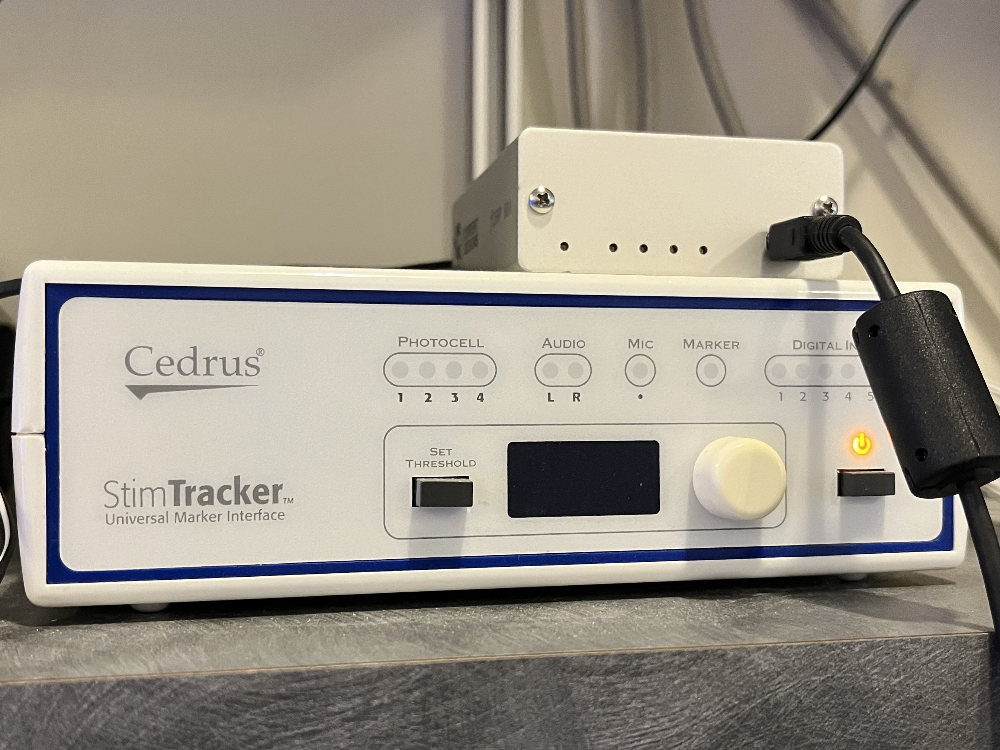
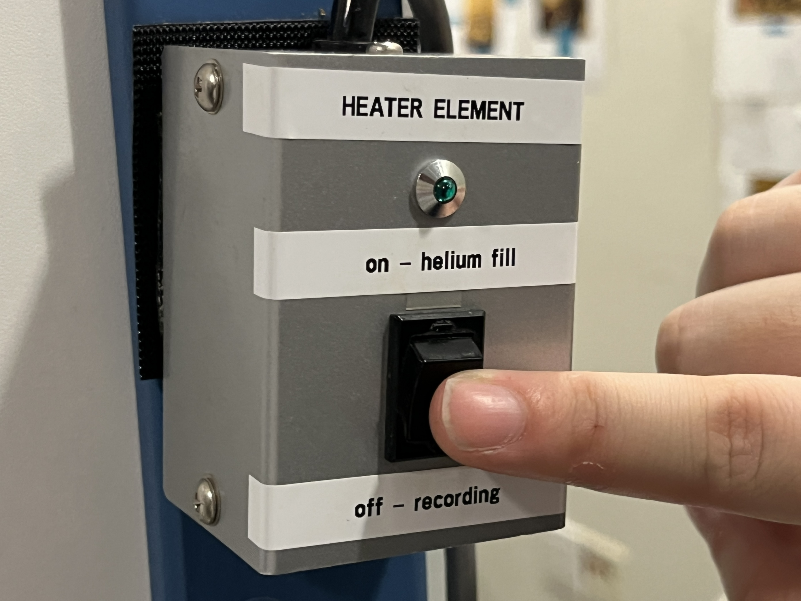

# BEFORE PARTICIPANTS ARRIVE (30 mins before intake)
## Turning everything on (in order)
- Remote control (for the projector) first


- Exhaust fan off (light switch near helium refill room)


- Magnetically shielded room lights (green button) -> It's possible to adjust the lights. We generally keep it in the middle when they're getting set up, but once the experiment starts, we dim it a bit


- Active shielding (black button w green dot, hold until green) - The same to turn it off- hold until light turns off


- The stimTracker is linked to the button box where the participants gives the answer - do not touch!




- Check if the data transfer switch (green box) is turned to MAC (for the psychopy software) or to PC (for the Presentation software)


- Turn media box on (black box w smooth button, press until hear turn on - turns on tv and mic)


- Trigger box on mac when using psychopy


- Make sure helium fill is off when we're recording - remember to turn it back on when we're done recording



- Turn on marker box in machine (big gray box w wires for each marker color)


- Open FastScanII in Jeff's office (turn on FastScan box, will hear chime when online)


## Eyelink software
- Leftmost dell monitor on (press box -> on)
- Select windows or eyelink software (select eyelink software) turn heater element off (“off- recording”)
on eye tracker
- DOS menu brought up
- Select windows or eyelink software (select eyelink software)
- Select “output/record” button
- “open file”
- In file main menu use the keyboard corresponding to type in R number
    - This creates a file for the R number
    - This allows us to just hit “record” later


## Setting up experiment
On main dell computer (the one that records data, not eye tracking one)
- Create a folder with your name under Desktop/Experiments
- Put your project folder inside, and your documents inside of it - get your documents from your server file
- Open terminal
- Give it the route to where your script is (your folder or subfolder): `cd Experiments/.../expt`
- Give it the name to your experiment doc (or the practice version of it, if you have different files for them): `python expt.py`


## MEG acquisition - auto-tuning
(Remenber to auto-tune before every time you start recording)
- Pull up meg160 app
- Go to auto tuning (teal icon) -> hit ok. It initializes the sensors
- After auto tuning go to acquisition window (dark blue icon with three squares under it)
- select condition library
- Enter R number as

## Record an empty room - which we need to do before EVERY participant
On main dell computer (the one that records data, not eye tracking one)
- Set both patient ID & patient name to their R number (we need both because one is gonna be the file name and the other will be the metadata one)
- Go to file directory (folder icon at very bottom of screen, not in-app), go to
    desktop > subject data > [folder corresponding to their R number] > [their R number], then create folder w format `R-number_Expt_Date` (e.g. R0026_GreenPapaya_7.12.23), copy address (right click & copy address), then paste in folder name
- Go to [[condition library - the thing that gives us parameters for recording]], select (or set up!) experiment-specific condition library, press “load”
- Press "lock" button
- Continuous mode, press "start", change acquisition time to 180s
  (Tip: for the channels monitor, y-scale of 16384 is optional but a good setting for monitoring recording session)
- When it's done, menu will come up, save w format R-number_emptyroom_Date
  (If the channels monitor is not green, we can open the door (unlock button). When it's green, it's recording)
- Now we can open the door


# PARTICIPANT INTAKE
## Find participant's R number, if new participant, assign them one
On the computer that saves participant information (not the one in jeff's office)
- Get the participant's name and DOB
- Open wernickE.xlsx in excel
- Control f to search for their name
- If they haven't been participants before, drag the last R number down and then enter the name & DOB info from the participant info form (PDF from jeff's office)


## In jeffs's office
### Greet participants
- Guide participant to read and sign the consent form (remember to put their R number at the top of the form)
- Open the information form, save it as pdf after participant has filled it out
- Explain experiment details

### Head scan
- Get consent form, DOB, R-number -> file away
- Draw dots on head using the template:


- This image shows where the nasion and tragi are located.
- The left (red) and right (yellow) markers should be drawn using a makeup pencil approximately 1 centimeter away from the tragus, towards the frontal side of the participant. The center forehead (blue), left forehead (white), and right forehead (green/black) markers can all be drawn using the stencil template found in the office, after aligning the stencil with the nasion. (Picture needed)

- Put on neck brace (divot is where the chin goes)
- Then put black FastScanII tracker over neck brace (to orient the scanner in space)
  - The sensor should locate on the right side of the participant
- Click laserpoint (instead of scan), then full click, then point at sensor box on neck, then half-click until box goes away (to initialize), then click laserpoint again
- “Insert” -> reorients the head shape, check throughout scan
    open sweeps menu so that can deselect specific sweeps if need to
- Go to laser pointer, go to stylus list, do positions w laser
  - Sequence for collecting the Fiducial and Marker positions:
    1. Nasion
    2. Left Tragus
    3. Right Tragus
    4. Left (Red) Marker
    5. Right (Yellow) Marker
    6. Center Forehead (Blue) Marker
    7. Left Forehead (White) Marker
    8. Right Forehead (Green/Black) Marker

- Save as, R number & date format

### confirm that participant is free of metal.
```
GIVE EXAMPLES: "Do you have any piercings, retainers, jewelry, watches, belts? Do you have an metal rods, implants, or screws? Do you have a bra with underwire or metal clasps?"
IF YES: Ask to remove and offer cloth scrubs to cover up, otherwise, ineligible for the study :(

This only impacts our data quality (we can't recover any metal-contaminated data) -- this does not harm the participant!!
```

## In MEG room
### Set up participant
- Put on electrodes, tape wires to shoulder to keep from moving
- Green tape is black electrode
- Put pillows (for side head pillows, have participant turn head by following your finger)
head pillow goes in pillowcase, side pillows go in tissues
- Click left eye in EyeLink                               
- Start running Eyelink
### IS THE DOOR CLOSED?? CLOSE IT!! then, and ONLY then, lock it! Do this before starting acquisition
Example on how to close the door properly (push the black button):


### Running a participant     
On main dell computer (the one that records data, not eye tracking one)
- Set both patient ID & patient name to their R number (we need both because one is gonna be the file name and the other will be the metadata one)
- Go to file directory (folder icon at very bottom of screen, not in-app), go to
    desktop > subject data > [folder corresponding to their R number], copy address (right click & copy address), then paste in folder name
- Go to [[condition library - the thing that gives us parameters for recording]], select (or set up!) experiment-specific condition library, press “load”
- Press "lock" button, then press "start"

#### On main dell computer
    Lock
    Marker measurement, start
    Look at the markers, make sure they're around the right place, if looks good, press ok
    Go to continuous mode, make acquisition time 3500, start
    Tell participant to start task
    Fill out the sheet in binder (see example sheet photo)


# AFTER THE EXPERIMENT
If the channels monitor is not green, we can open the door (unlock button). When it's green, active shielding is ON and it is NOT SAFE to open the door.

## On acquisition window
- Abort
- Save in R number_experiment name_date format (R0026_GreenPapaya_7.12.23)
- Last marker measurement, start

## On experiment mac
- Escape or quit experiment

## Take participant out
- Open the door and release the participant
- Don't forget to turn the helium refill switch on again

## Save eyetracking data -> to server
- Close file
- Power off w button on base
- Power on & click windows this time
- Move the files to folder on WELOVEJEFF external hard drive
- WELOVEJEFF external hard drive -> wernickE.xlsx computer

## Noise reduction on acquisition computer
- File open
- Noise reduce the file
- Open file, edit > noise reduce, then execute, then save as file name with
_NR at end (e.g. `R0026_GreenPapaya_7.12.23_NR`)
- `R0026_GreenPapaya_7.12.23` (for eg) folder to data FASTKEY2’s data > subject
data files > [R range subfolder] > [R number subfolder]
- Finish log sheet in binder (how many runs, etc)

## On wernickE.xlsx computer
- Go from data > subject data files > [R range subfolder] > [R number subfolder]
move the folder corresponding to the experiment run on server (e.g.
`R0026_GreenPapaya_7.12.23`) to `PersonalFiles > User > expt > raw`

- Clean up head shape
- Open laserscan file (`.fsn`)
- Select, [make selection,] delete
- Get rid of any shoulders, deface the scan, etc.
- Generate -> apply basic surface
make sure that points are under 9000
- Export basic surface
- Save to server
    `SERVER > NEUROLING > PersonalFiles > User > expt > raw / R0026_7.12.23_HS`
- Save stylus points as well (prompted), now `R0026_7.12.23_points`
- Discard changes to original `.fsn` scan


# MATERIALS NEEDED
- Psychopy script (experiment script.py and port_open_send.py), with stimuli list - this goes on the big IMac from the server
- Set up a specific condition library for experiment
