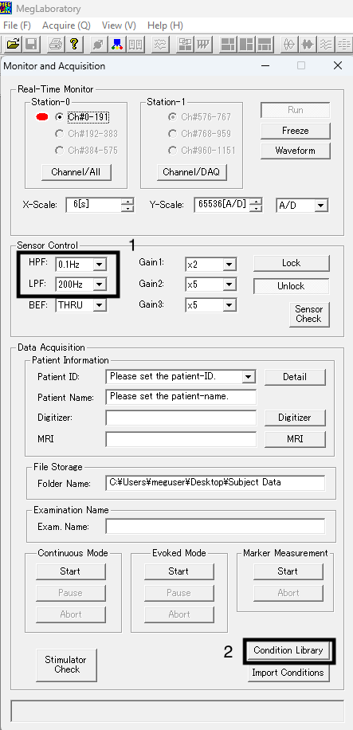

Since the data that the MEG machine picks up on is inherently a mix of useable data and noise, we apply multiple steps to try to get rid of the noise. One of these steps is applying a low and high pass filters during data acquisition. That is, we specify that no magnetic waves above or below a certain threshold should be recorded. These filters are set inside the MEG160 program. Be careful when setting these filters, while you can always add additional filters to your data later, if you add these filters on the data acquisition, anything you filtered out is inherently not recorded, and thus not recoverable. 

# Background

The magnetic an MEG sensor records can be transformed into a set of sine/cosine waves that vary in amplitude and frequency. Since we know that only certain frequencies reflect neural activity that we care about, we can filter out the sine/cosine waves at other frequencies. The typical bands of frequencies studied in neurolinguistics are:

| Wave Band | Frequency | Column 3 |
| :--- | :--- | :--- |
| Gamma | 30-100 Hz | Row 1, Data 3 |
| Beta  | 12-30 Hz | Row 2, Data 3 |
| Alpha | 8-12 Hz | Row 3, Data 3 |
| Theta | 4-8 Hz | Row 4, Data 3 |
| Delta | 0.5-4 Hz | Row 5, Data 3 |

To get rid of waves with other frequencies we apply a low and high pass filter. A low-pass filter allows waves of lower frequencies to "pass", filtering out high frequencies. The high-pass filter does the opposite. So a high-pass filter of 0.1 Hz allows all waves with frequency of ≥ 0.1 Hz to pass. A low-pass filter of 200 Hz allows all waves with a frequency of ≤200 Hz to pass. 

The exact threshold that you want to set depends on the analysis you want to conduct. The general lab standard is a high-pass filter of 0.1 Hz or 1 Hz and a low-pass filter of 200 Hz. A high-pass filter of 1 Hz helps eliminate a lot of environmental noise, however this does get rid of some Delta-band activity. A high-pass filter of 0.1 Hz is recommended if you plan on doing time-frequency/frequency analyses. 

Some past lab papers and their frequencies are given below. 

| Study | Frequency | Analysis |
| :--- | :--- | :--- |
| Flower & Pylkkänen 2026   | 1-200   Hz | ANOVA |
| Azar & Marantz 2025       | 0.1-200 Hz | Regression |
| Messi & Pylkkänen 2025    | 0.1-200 Hz | ANOVA |
| Flower & Pylkkänen 2024   | 1-200   Hz | ANOVA |
| Li, Lai, & Pylkkänen 2024 | 0.1-200 Hz | Multivariate Pattern Analysis, Regression |

# MEG 160

Online filters are set in MEG160. They can either be set under `Sensor Control > HPF/LPF` (1) or under a preset loaded from `Condition Library` (2).

