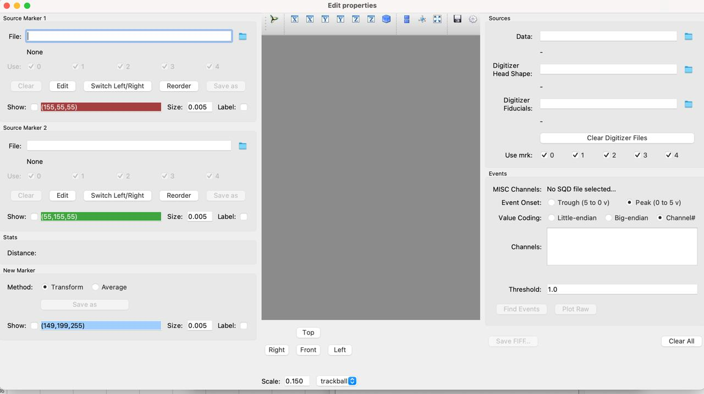
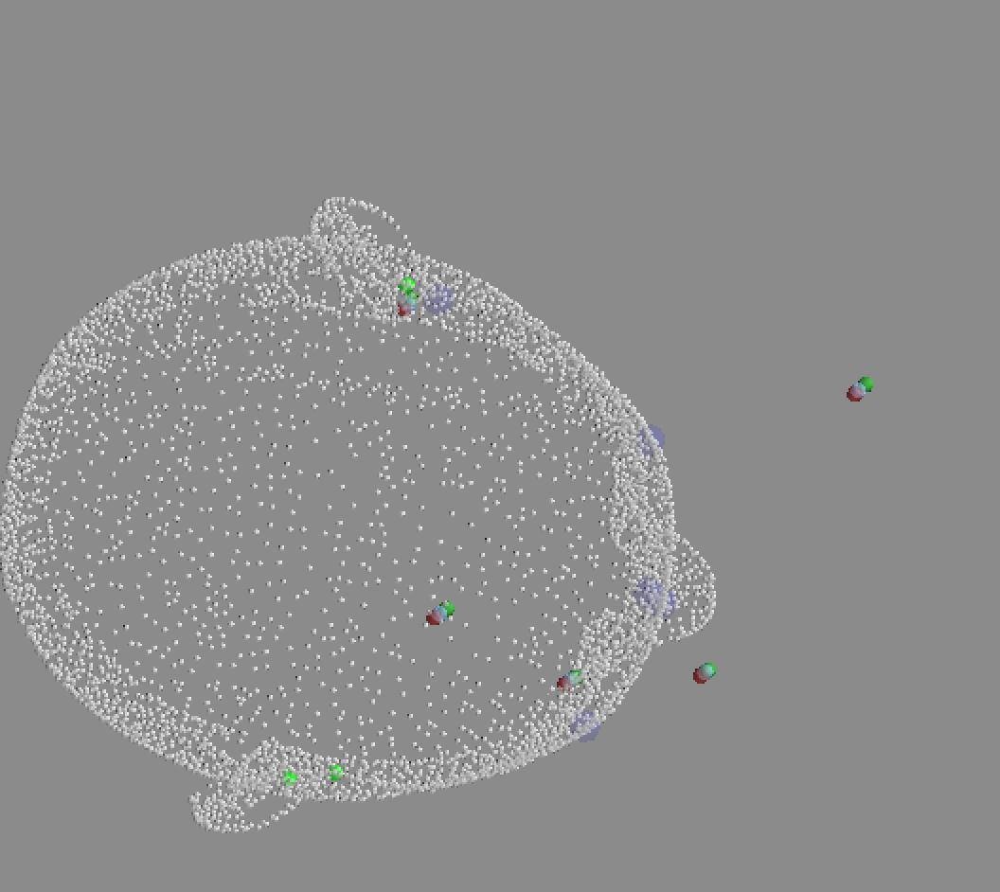
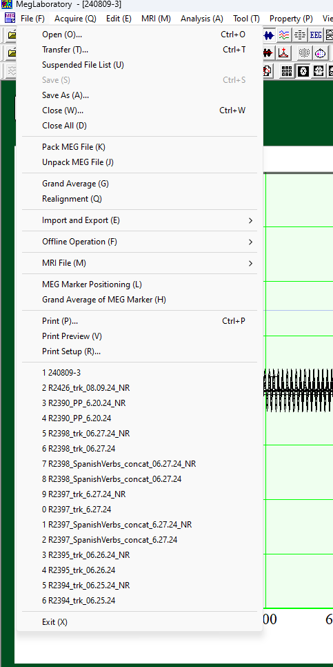
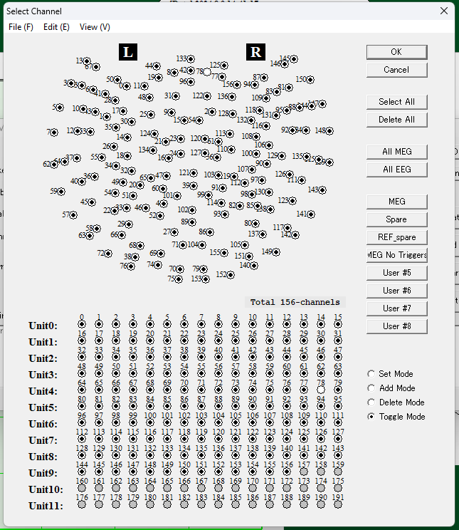
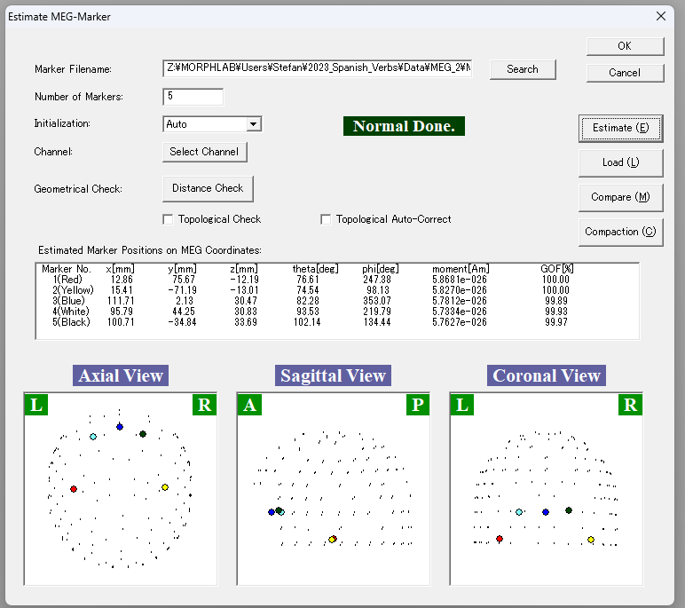

# Kit2fiff

## Overview
This is the first step of the preprocessing pipeline, where you convert all of your raw data (after noise-reduction) and marker measurements into a single file that can be read and manipulated by MNE.

Input:
- pre-experiment marker positions
- post-experiment marker positions
- experimental (MEG) data
- Head scan (from FastScan)
- Marker measurements (from FastScan)

This should be done in the coregistration conda environment.

##Details
To activate the gui to convert your files, enter the corresponding conda environment (see setup section to set this up) and execute the command to open the file from terminal.

```
conda activate coregEnv
mne kit2fiff
```

This will open a gui that looks like this:




Required input, path to the following files:

- Source Marker 1: (.mrk ) File that has the marker measurements from inside the MEG machine before the start of the recording of the data you are analyzing
- Source Marker 2: (.mrk) File that has the marker measurements from inside the MEG machine after the end of the recording of the data you are analyzing
- Data: (.sqd) File containing the MEG recroding of the data you are analyzing
- Digitizer Head Shape: (.txt) File containing coordinates of the head scan of your participant from FastScan. This should be the coordinates after you have generated a basic surface of the scan.
- Digitizer Fiducials: (.txt) File containing x, y, and z coordinates of the 5 marker measurements from FastScan.


After you load all 5 files into the gui, all marker measurements will appear on the interface. You must now check that the marker measurements from the MEG scan (presented in green and red) align with the marker and headshape measurements from fastscan. In most cases they will. In case they don’t, see the troubleshooting section.

Select the `Peak` and `Little-Endian` options.  Then click on Plot Events. The output should show you your trigger schema with the correct number of trials per condition. If everything is correct, click `Save Fiff`...


This process should be repeated for each participant and each separate recording. If your experiment has multiple parts (e.g. a main and localizer task) or if you took multiple recordings (because they participant had to take suprise breaks and get up, or your experiment has multiple recording sessions), this process should be done separately for each recording.


# Details about the GUI
The gui has the following things that you can edit as needed:

- (MEG) markers section:
    - Edit: Edit the coordinate points of any of the five markers
    - Switch Left/Right: Flip the coordinates (Used when??)
    - Reorder: Reorder the coordinates (used if you placed the markers on the participant’s forhead in the incorrect order)
- Center window:
    - You can add an x-y-z axis guide which is super helpful in orienting yourself
    - Top/Right/Front/Left: Position the scan in a certain way
- Sources:
    - Use Mrk: Deselecting a specific marker excludes that marker from the estimation. This is helpful if the fastscan of a specific marker is incorrect
- Events: This section is dedicated to the event triggers you send
    - Small-Endian/ Big-Endian: Triggers are encoded in a binary schema (see below for explanation)
    - Channel#: Each individual trigger is sent to separate channel.
    - Trough vs. Peak: is your trigger defined by a drop in signal (trough) or a spike in the signal (peak). Our standard lab practice (and the way most scripts are set up) send a trigger peak, thus you should select Peak
    - Value Coding: How are you encoding your triggers based on which channels they are sent to. In this lab we usually use big-Endian


# Troubleshooting


## Markers are good relative to eachother, but don't align with the head

It's kind of hard to see from the images, but in this case, the markers seem to be correctly aligned with eachother but not to the head. It's as if they were all shifted 90 degrees.
Examples:



The issue is most likely that the fast scan of the markers is incorrect:
- You did the scan of points wrong. In this case, go to the lab computer in the MEG where you took the scan and open the original file of the scan. You will have the order of the point markers that you took. Check to make sure that you took the measurements in the correct order and that you don't have any extra (more than 5) markers.
- If you have extra markers, deselect them. Then export the file.
- If you took the scans in the incorrect order, you can either go to the output file that you have already exported, and simply switch the coordinate rows in the text file.
- Placement of markers on participant's head is incorrect: you put the markers on the person's head in the incorrect order. While you can fix this in the kit2fiff gui, you have to know what markers you put where, otherwise it's really hard to reconstruct what you did wrong. In that case either throw out the data or ask Jeff for help.
- If you do know the mistake you made, you can edit the marker positions in the kit2fiff gui's (MEG) Markers Section, using the Edit, Switch, and Reorder functions described above.


## one of the markers is way off, the other ones seem ok
It would look something like this, note the middle marker seems to be outside of the head whereas all of the other ones seem ok.


This happens when the markers are estimated incorrectly (when taking marker measurements in the MEG and the program gives you that yellow warning). In order to fix these, head over to lab computer that has MEGLAB installed on it. Open your marker measurement file. Go to *file > MEG Marker Position (L)*.



Click on *Load* and open your marker measurment file again (I'm kind of unsure why we have to open it twice, and something weird happens with saving, so if you find a better way to do this, lmk). Click *Estimate*. You should immediately see the issue that you saw when doing kit2fiff in the little gui:


In order to fix the issue, click *Select Channel*. The following screen will pop up:



Here you see all of the channels that are selected. Click the *Toggle Mode* and toggle a channel, click *ok*, then re-estimate the markers. Continue doing so until you find a combination of channels for which the marker is correctly estimated. Note, it is usually either channel 14 or channel 78. Afterwards the little gui should give you normal looking markers:




After you are done, click *File > Save As*. Note that the saving is super weird. I think what happens is that it saves the toggle settings on the file that you uploaded in the mini gui, but not the main file. So that the "Saved As" file ends up being the original file, where as the file with the original name ends up having the toggled and corrected features. IDK, when loading the markers back in just play around with it, something should work.


# Notes to get to later for the wiki

Send triggers to channels 1-7, so then ID is 2^X

Code 33 = Channel 0 and channel 5

2^0 + 2^5


channel# = the channel number to which you send triggers


"Find Events" button → let's you know if any trials are missing.

-raw


___
