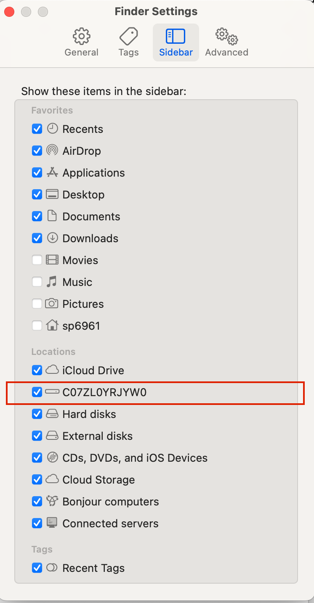
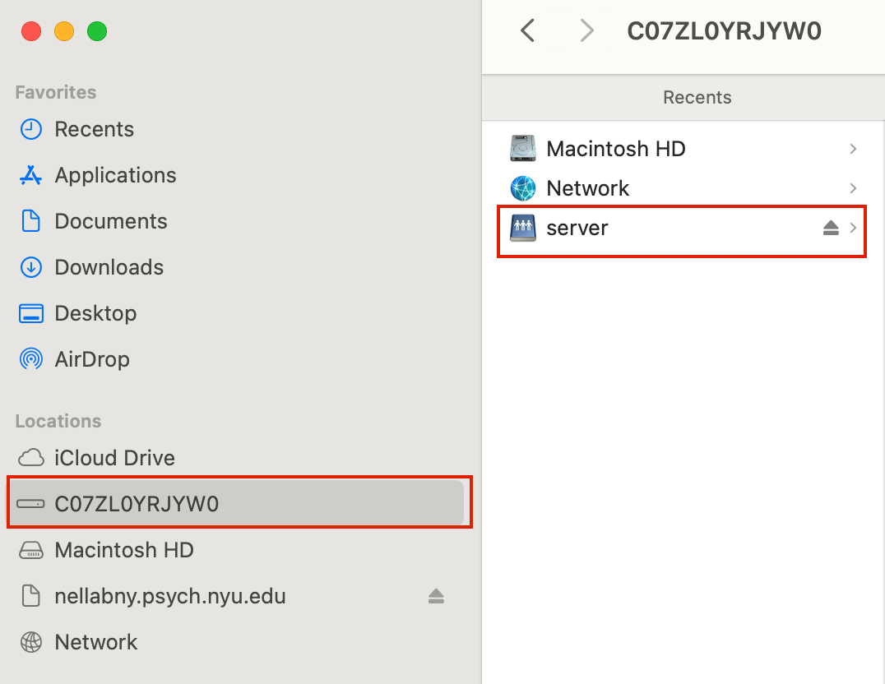

# Intro

The NELLAB has its own server which can be accessed by any lab member. Since the neural data we analyze is very large, we store it on the server, which has (as of 2022) ~103 TB of memory. Data on the server is stored in parallel on three separate hard-drives in the lab, ensuring that if one hard-drive dies, none of the data will be lost. Therefore, it is standard practice in this lab to save all data, pre-processing scripts, and analysis scripts on the server.

The server is maintained by the Psych IT. If you have any issues, you can reach out them [here](https://psychcns.freshdesk.com/support/home). 

Accessing the server must be done either on NYU wifi, or via the [NYU VPN](https://www.nyu.edu/life/information-technology/infrastructure/network-services/vpn.html). 

A few warnings to take note of:
- While the contents of the server are further backed up by Psych IT, once you delete a file from the server, it is very difficult to recover it. 
- Computers often (~ once a day) loose access to the server temporarily. This means that if you have a program/analysis running off of the server (i.e. you are running the script locally, but the script is stored on the server) and the server looses connection, the process will be terminated. Therefore, if running anything that takes several days, either transfer the file locally or add safety checkpoints in your script.

# Organization

The server is split up into three main sections: `MORPHLAB` (for Alec Students), `NEUROLING` (for Liina students), and `SHARED`. Each of the lab folders contains both a `Projects` folder for storing project-related scripts/data and a `Users` (Morphlab) or `PersonalFiles` (Neurolab) folder for storing individual project-related scripts/data. In Morphlab, if you are working on a joint project, you should store it in the `Projects` folder. Otherwise, if you are the only student working ont he project, you can likewise store it under your own `User` folder. If you are an incoming student, you should create a new personal folder to store various files. 

The `SHARED` folder is currently a mess and needs to be cleaned. However, there are several important folders you should familiarize yourself with. 
- `Corpora`: this folder contains various corpora that students have used. If adding a new corpus, please udpate the Readme.md file. 
- `Methods Meetings`: this folder contains tutorials and slides from past methods meetings (you can find a list of past methods meetings from Spring 2025 on this wiki under `Lab > Methods Meetings`)
- `LAB_MEETING_PRESENTATIONS`: Upload your lab meeting slides here
- `MRI`: The MRIs that we have access to (all MRIs in this folder come from participants who have given us written permission to use their MRI in future studies)

# First Time Access

For mac users: 
1. Open Finder
2. Click the `Go` tab at the top 
3. Click `Connect to Server`
4. In the top box, type `smb://nellabny.psych.nyu.edu/server`
5. Click `Connect`, then type in your NYU username and password

For PCs:
1. Choose Map Network Drive (sometimes under the Tools menu) 
2. Enter `\\nellabny.psych.nyu.edu\Server`
3. Choose `Connect using different credentials`
4. Username must be `ad\<netID>`, password is your NYU password 

Note: this must be done either on NYU wifi, or via the [NYU VPN](https://www.nyu.edu/life/information-technology/infrastructure/network-services/vpn.html).

# Adding it to finder

To access via Terminal (mac):
```
cd ~ [gets you to user base directory]
cd .. 
cd .. [gets you to computers root directory]
cd Volumes/server [gets you to the server]
```

Once you connect to the server, for easy access from Finder, you can do the following:
```
Finder > Settings > Sidebar
```
This will open a window that looks like this. Select the name of the device. 



From then on, the name of the device will appear under `Locations` on the left sidebar of Finder. If you are connected to the server, you can easily access the server files from there. 


