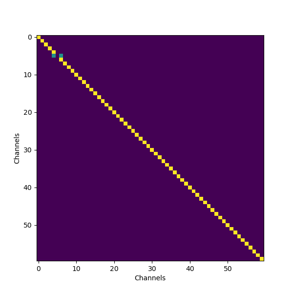

## Table of contents

{: .no_toc .text-delta }

1.  TOC {:toc}

------------------------------------------------------------------------

<!--- Note to editor: please update the links with the correct targets :D --->

# Spatial filtering

Raw MEEG data is at its core a **channel x time** matrix which is extremely malleable. Spatial filtering represents the output as a weighted transformation of the input but instead of manipulating temporal information, we are transforming the data by manipulating the information across channels.

Spatial filtering methods include: interpolation, PCA, [ICA](../ICA.html), re-referencing (for EEG data only) and even [source reconstruction](../../Source%20Reconstruction/Source%20Reconstruction.html)! Only the first two will be covered here.  

## Interpolation
The easiest spatial transformation is interpolation.
After annotating bad epochs and leafing through your raw data, you'll notice that some channels are bad.


For the MEG, ``MEG 079`` is always a bad channel and ``MEG 014`` tends to be bad.

We usually remove bad channels as these are obvious sources of noise that worsen our data. More often than not, after removing bad channels, we want to interpolate them. This simply consists of taking a weighted sum of the activity at neighboring channels (in MNE the operation is more complex and involves minimum norm estimates but the underlying idea is the same).

Here is what the matrix for interpolating a bad channel as the average of the two neighboring channels would look like:



In the above code, channel 5 has been removed and replaced as the weighted sum of channels 4 and 6.

Keep in mind that by interpolating channels, we are introducing correlations between channels in our data. This reduces the rank of the channel x channel covariance matrix and is something to keep in mind for other forms of spatial filtering like PCA or source estimation.

**!! Important !!** Interpolation is usually the last step you do before saving your cleaned data. Your data should already have been ICA'd, artifacts rejected and bad channels rejected before you interpolate the bad channels.

## Prinicpal Components Analysis (PCA)

Principal Components Analysis is both a spatial filtering and dimensionality reduction method. It's mostly used to reduce high dimensionality data like word embeddings or even MEEG data in order to plot them in two or three dimensions or to make the data easier to compute.

Warning: there's a bit of math involved.

### Eigenvectors, eigenvalues and covariance

#### Covariance
A covariance matrix is a square matrix that tell us how different variables in a dataset vary together. In the case of MEEG analysis, when we refer to a data covariance matrix, we're talking about the covariance of channels with each other over time: channels are the parameters and timepoints are the features.
The equation is simple:
$$
Cov = \frac{Data^TData}{N-1}
$$
*N* here is the number of channels.

#### Eigen decomposition
An eigenvector is a vector such that when it is multiplied by a matrix A, it only changes in length:
$$
A \vec{v} = \lambda \vec{v}
$$
This is equivalent to saying that:
$$
det(A -\lambda I) = 0
$$

Which is math for: multiplying our matrix A with the vector v collapses the matrix down to one dimension.

### Combining both
Mathematically, principal components are just the **eigenvectors of the covariance matrix** of our data. What that means is that by computing a PCA, each component or eigenvector represents a direction of **maximum variance** in our data. The eigenvalues tell us the amount of variance captured by each component. Importantly, each vector is orthogonal to the other (their dot product is 0 and they are **linearly independent** so can't be written as a multiple of the other).

MEEG channels are not independent: channels that are picking up on the same sources will be correlated with each other.

One advantage of using PCA is that our components are uncorrelated with each other, so it allows us to represent our data free of those underlying correlations.  

(Note: another way to understand PCA is by looking at the SVD of the covariance matrix!)

#### What makes PCA a spatial filter?

Each MEEG channel is a weighted sum of our components. Each weight tells us how much each component contributes to overall activity in each channel.


The inverse is true: components are a weighted sum of the activity across channels. PCA highlights the most significant patterns of activity across channels by finding linear combinations of channels that maximizes different degrees of variance.   

The number of components we are successfully able to estimate is determined by the rank of our data. Applying the PCA transformation is as simple as projecting our data onto the PCA subspace.


## Additional resources

<iframe width="560" height="315" src="https://www.youtube.com/embed/HMOI_lkzW08?si=AaAUAR1P3hAU4lFG" title="YouTube video player" frameborder="0" allow="accelerometer; autoplay; clipboard-write; encrypted-media; gyroscope; picture-in-picture; web-share" referrerpolicy="strict-origin-when-cross-origin" allowfullscreen></iframe>

------------------

# Code

## Interpolation

### Settings
Activate your analysis environment and import useful packages:

```python
import mne
import matplotlib as plt
import os
import numpy as np


%matplotlib qt
```

Define useful directories, load in and filter raw data:

```python
group = "GroupB"
PATH = f'/Volumes/Server/SHARED/Methods meetings/Fall 2024 Methods Meetings/Course_Project/MEG_data/{group}/Recording'

# set a directory where you'll save all your files
meg_dir = "/Volumes/Server/NEUROLING/PersonalFiles/Aline-Priscillia Messi/megmethods"
subj = "R2470"

# load in raw
raw = mne.io.read_raw_fif(PATH+f'/{subj}_EventModel_9.26.24_NR_raw.fif', preload=True)

raw_filt = raw.filter(1,40)
```

### Actual script
Here we're going to manually define bad channels in order to interpolate them.

```python
bads = ['MEG 079', 'MEG 014']
raw_filt.info['bads'] = bads
```
To do this visually, just plot your ``Evoked``, ``Epochs`` or ``Raw`` data and click on the channel you want to remove. MNE saves them automatically.

```python
raw_interpolated = raw_filt.interpolate_bads(reset_bads=True)
# reset bads clears the bads object in info
print(raw_interpolated.info['bads'])
```

## PCA

Before performing PCA on our raw data, we need to load a couple more libraries:

```python
from sklearn.decomposition import PCA
from mne.decoding import UnsupervisedSpatialFilter

```

sklearn computes the covariance matrix for us as well as getting the eigenvalues and vectors from it. PCA can only be performed on **centered data** (we remove the mean across channels from our data) but sklearn also does this by default.

```python
# extract the data
X = raw_filt.get_data(copy=False)

# define our PCA object
n_components = 50
pca = UnsupervisedSpatialFilter(PCA(n_components), average=False)

# apply PCA to data
pca_data = pca.fit_transform(X)
```

Here we've reduced our data to 50 dimensions for further analyses (such as CCA, decoding and more).
