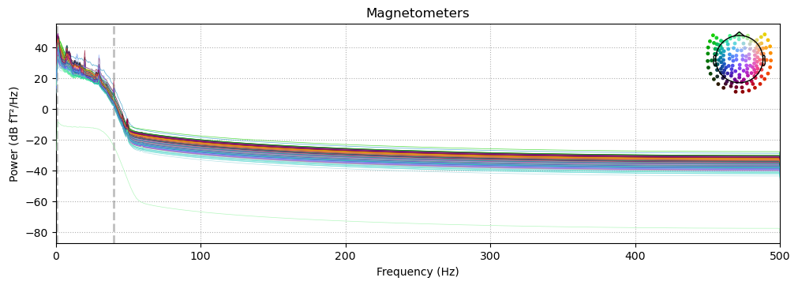

## Table of contents

{: .no_toc .text-delta }

1.  TOC {:toc}

------------------------------------------------------------------------

<!--- Note to editor: please update the links with the correct targets :D --->

# Temporal filtering

#### Frequency domain vs. time domain

MEEG data can be analyzed in two ways. These are defined based on the domain that is being manipulated: the *time domain* is where we are looking at the evolution of samples over time. The *frequency domain* is where we look at the specific characteristics (phase, amplitude, power etc.) of a frequency over a range of frequencies.

The [Time frequency](wiki/docs/MEG Analyses
/TimeFrequency.md) section will go into the theoretical basis for moving from one to the other as well as more practical steps.

When we filter our data, we are modifying characteristics of our data in the frequency domain. See below an image of raw MEG data in the time domain vs the (filtered) power spectrum of the same data:

##### Raw data


##### Power spectrum



## Finite vs Infinite response filters
Whenever we are filtering data, this boils down to **convolving** our signal with our filter. There are two kinds of filters that can be applied to our data *FIR* (Finite impulse response) and *IIR* (Infinite impulse response) filters.

#### FIR
FIR filters can go back to 0 (the response ends). They are stable and represent a weighted sum of the current and all previous timepoints.

#### IIR
IIR filters are *auto-regressive* which means that they compute the same weighted sum over the input as FIR filters **and** also include current filter output. These filters are infinite because they never return to 0 and as such always have an output. IIR filters can also lead to non-linear distortions of the data. They are however much faster and more computationally efficient.

### Types of filters
We can also define filters based on what they do to the data. Below are common filter types:

- **Highpass**: allows higher frequencies to pass through and attenuates anything lower than threshold
- **Lowpass**: allows lower frequencies to pass through and attenuates anything higher than threshold
- **Bandpass**: allows frequencies within passband to pass through and attenuates anything outside of thresholds
- **Notch**: attenuates a very narrow range of frequencies (most often used to target a specific frequency)
- **Brickwall**: not recommended; reconstructing a signal from only a subset of frequencies after using a FFT/DFT  

### Notes on analysis
When analyzing MEEG data we typically apply a bandpass FIR filter from 1 to 40hz. The lowpass 40hz filter removes high frequency artifacts and in this case removes electrical line noise (which is 60hz in the US), while the highpass 1hz filter minimizes slow drifts that are present in the data.

Data always needs to be filtered twice (once forwards and another backwards) with the same filter kernel in order to avoid phase shifts in the data. This is usually done automatically.

Because of the time/frequency tradeoff, it is better to filter the raw data before epoching in order to avoid *edge artifacts* in the frequency domain (these are sharps surges in power that happen when applying a temporal filter to the beginning and end of an epoch).

Artifacts in the time domain can be seen through bandpass and stopband **ripples** after a filter has been applied. These are just small fluctuations in the amplitude of each band.

## Aliasing
Since our data is sampled and not continunous, we need to pay extra attention to high frequency artifacts in the data. The **Nyquist frequency** (N = sampling rate/2) is our limit as any frequency above it will `alias` as a lower frequency in our samples. Only frequencies which are a (integer) multiple of our sampling rate alias as lower ones.

So if our sampling rate is 1000hz, we at least need to apply a 500hz lowpass filter on our data to remove high frequency artifacts.  

If we downsample our data, we need to make sure to apply an additional lowpass filter at the Nyquist frequency of our new sampling rate.

## Demean, detrend and baseline

While demeaning, detrending and baseline correction are not strictly temporal filters, they can be thought of as transformations of temporal information (which is why they're included in this section).

### Detrending (and demeaning)
We can fit polynomials of varying degrees to our data in order to account for slow-drifting artifacts that span multiple epochs. This boils down to finding drifts in the data that can be predicted by a linear function and then removing these trends in order to clean the data.
Which degree you choose and the window of analysis you choose both depend on the length of the data that you're utlimately interested in. A rule of thumb is to fit the polynomial on the transient change timescale that you care about.

Most analyses focus on removing the 1st and 2nd order polynomials from data eg. sweat, heartbeat, etc.

#### Demeaning
Demeaning is a special case of detrending where we remove the zero-order trend (or mean) from our data.

You can use demeaning as a form of baseline correction by removing the mean across channels for one epoch or you can use demeaning to center your data by removing the mean across time for each channel.

The latter option is often used before more complex analyses like PCA or ICA.

### Baseline correction
Baseline correction is a transformation of the data that adjusts it based on a baseline period. The most common form of baseline correction is just removing the mean activity over the baseline period from the data. But you can also remove the median or even z-score the data.
In most experiments, the baseline window will be ~100ms prestimulus to stimulus onset.

The idea behind doing this is to normalize activity relative to the baseline period. Ultimately, this emphasizes responses to the stimulus by removing any prestimulus activity which in this case is also likened to noise.

------------------
# Code

Now let's see how these theoretical concepts are applied when we're analyzing a dataset.

Conveniently in MNE, filtering and baseline correction are two lines of code.

For the rest of this walkthrough, we'll be analyzing the **MEG** dataset for **Group B**.

## Settings

Activate your analysis environment and import useful packages:

```python
import mne
import matplotlib as plt
import pandas as pd
import os
import numpy as np


%matplotlib qt
```

Define useful directories:

```python
group = "GroupB"
PATH = f'/Volumes/Server/SHARED/Methods meetings/Fall 2024 Methods Meetings/Course_Project/MEG_data/{group}/Recording'
# set a directory where you'll save all your files
meg_dir = "/Volumes/Server/NEUROLING/PersonalFiles/Aline-Priscillia Messi/megmethods"
subj = "R2470"
```

## Filtering

Load in raw data:

```python
raw = mne.io.read_raw_fif(PATH+f'/{subj}_EventModel_9.26.24_NR_raw.fif', preload=True)

```

Plot it with a high pass 0.5 hz filter to look at the data:

```python
raw.plot(picks='meg',duration=60, n_channels = 157, highpass=0.5, filtorder=4)
# picks selects just the MEG channels
# duration sets how long in s the window is plotting
```

This is how you filter:

```python
raw_filt = raw.filter(1,40)
# plots the power spectrum of the data
raw_filt.compute_psd(fmax=40).plot()
```

## Baseline correction

Both demeaning and detrending are arguments that are added when defining epochs.
For the sake of this example, we'll find events and define epochs based on those events (See the [Epoching](../epoching.html) section for more detail about how and why we do this).  

```python
# find events based on triggers
events = mne.find_events(raw_filt, min_duration=0.002)

# choose only the MEG channels
picks_meg = mne.pick_types(raw_filt.info, meg=True, eeg=False, eog=False, stim=False)``
```

Let's define an epoch of 1s with a 200ms prestimulus period and an 800ms post-stimulus period. We'll use that prestimulus time as our baseline period.

```python
baseline = (-0.2,0)
epochs = mne.Epochs(raw_filt, events, tmin=-0.2, tmax=0.8, baseline=baseline, picks= picks_meg)
```

What this does is calculate the mean activity for each epoch and channel and removes it from the data. If we set the baseline to ``None, None`` that uses the whole time period effectively demeaning our data!

## Detrending

Note that MNE only offers zero and first-order detrending of data when defining epochs. Anything higher will require custom code. Here we've removed baseline correction as is recommended.

```python
epochs = mne.Epochs(raw_filt, events, tmin=-0.2, tmax=0.8, baseline=None, picks=picks_meg, detrend=0)
```
