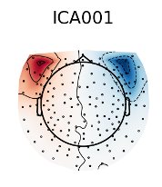
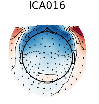
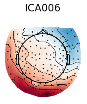
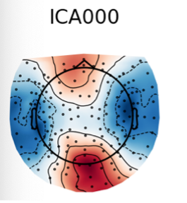
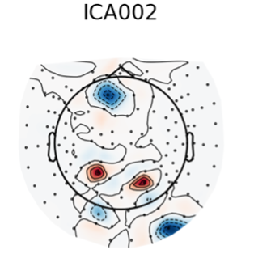

To Do (Stefan):
- Add in theoretical section
- Add in tutorial links
- Add in time maps of components

# Overview

Independent Component Analysis, or ICA, is a mathemetical tool that rearranges data from being organized per channel to being organized per component. A component is an abstract representation of underlying source signal that contributes to the observed data, and can represent things like a heartbeat, eyeblink, or multiple brain regions (adjacent or not) that produce activity in the same pattern. We use ICA to further clean our data. By rearranging our data into components, we can find which parts of our data most likely represent sources that are not from the brain (environmental noise, eye movements, or heartbeat) and remove that subsection of the data.

This section is organized as follows: The **Theoretical Background** goes over what an ICA does conceptually. While this is important to know in the long run, if this is your first time working with MEG data it is not crucial to using this method. The **Implementation** section goes over how to use the ICA in MNE python and how to recognize common components.

# Theoretical Background


## Tutorials


# Implementation

ICA is applied to a `raw` object, in other words your raw data. The following three lines of code fit and plot the ICA:

```
# Generate ICA model
ica = mne.preprocessing.ICA(n_components=0.95, method='fastica',random_state=1119)

# Fit model
ica.fit(raw)
```

The first line of code creates the mathematical ICA model that will be used on your data. `n_components` determines the amount of variance (in percent) that will be explained by the ICA components. That is, it tells the model to give you back as many components as is necessary (as long as it is less than the number of channels) to explain `n_components` percent of your data. This is done for practical reasons. Since you can fit as many components as there are channels, and our MEG has 157 channels, fitting this many components would be computationally difficult and require a lot of time. However, usually anywhere from 10-40 components will suffice to explain 95% of the variance, and those components will usually be enough to capture any non-brain components we want to get rid of. `method=fastica` specifies the specific implementation of the ICA model, i.e. FastICA. `random_state` specifies a random seed, so that the output of your model will always be the same if run on the same set of data.

The second line of code fits the ICA model to your data. Note that this can take up to 5 minutes. Due to the computational complexity of this operation, it is recommended to run this code on a lab desktop rather than your laptop. `ica.fit()` "rearranges" your data from channel dimensions to component dimensions, as described in the Theoretical Background section.


The next step is to visualize your components and select the ones that you will removing. This is done with the following two lines of code:
```
# Visualize and select components to remove
ica.plot_sources(raw)
ica.plot_components()
```

This will result in two windows that look like this:

The first is a topographic map of each component, mapping the activity associated with a particular component over sensors. The second is the activity associated with a particular component over time. You should look through both to identify which components are due to non-brain acitivity (see below). To get rid of these components, simply click on them. When you exit out of both windows, the components you selected will automatically be printed. If you want to double check that the components were properly selected, you can also run `print(ica.exclude)`.

Note: Some versions of MNE python require you to "quit" out of the MNE application that opens up when you run this plotting code, by double clicking the "MNE" icon in your application dock, and selecting "quit application".

## Component Identities

**Eyeblinks**



**Eye Saccades**



**Heartbeat**



**Iron Cross**



**Bad Channel(s)**



Generally we avoid getting rid of bad channel components, in order to avoid getting rid of any data that may have been captured in this component alongside the bad channel. Instead, we get rid of the bad channels prior to ICA. If you find bad channel components, you can take note of which channel the component topography is clustered around, go back and get rid of that channel from your data, and rerun the ICA to see if this got rid of the noise. As you can see, the above component `ICA002` most likely has 4 bad channels.

## Considerations  

```
ica.fit(raw, reject={'mag':5e-12}, reject_by_annotation=True)
```
There are two additional parameters that can be included in your ica.fit(): `reject={'mag':5e-12}` and `reject_by_annotation=True`. The first automatically rejects any epochs that exceed an amplitude of `5e-12` Tesla and the second excludes any sections of the data that were manually annotated as "bad". The addition of either of these two parameters is unnecessary and varies from researcher to researcher in the lab. Fellow lab members give the following considerations:

- [Stefan Pophristic] I usually include both of these parameters. When epoch my data I automatically exclude any epochs that fall above this threshold (and sometimes an even stricter threshold) and exclude any epochs that have data that was manually annotated as bad (due to excessive movement or radio bursts). Since I will already be excluding this data in my epoching, I want my ICA components to reflect other sources of noise rather than this noise. That is, if my epochs with radio bursts are interpreted by the ICA as two components that explain 30% of the variation, then some more subtle sources of noise may not be picked up by the ICA, since they represent a much smaller part of the variation of the overall data.
