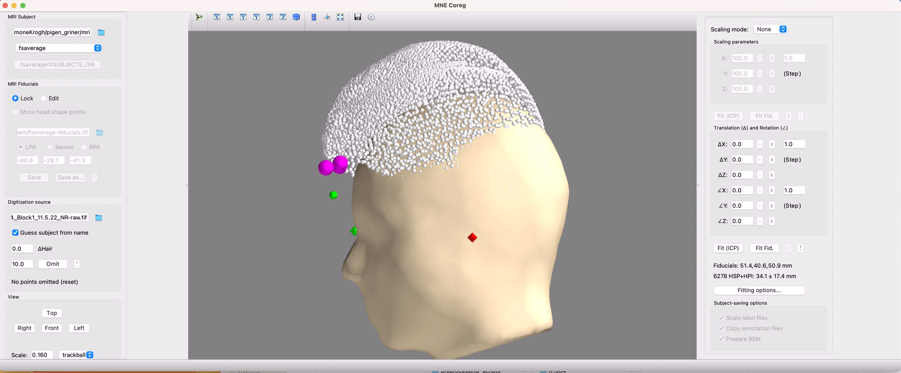

# Coregistration

## What do we mean by coregistration?

Coregistration refers to the process of aligning the points and markers (obtained using the FastScan laser) with a brain. It is always preferable to use the participant's own MRI if available; alternatively, the fsaverage brain is used.

Fsaverage and information about how to download it can be found here: https://surfer.nmr.mgh.harvard.edu/fswiki/FsAverage

Important note: If you already have fsaverage, either in one of your own project folders or wish to copy it from someone else's project folder on the server, you CANNOT just copy-paste the files as you'd do with other files. This will likely corrupt the files. Instead, click the 'fsaverage=>SUBJECTS_DIR' button in the coregistration GUI (see below).

## Step-by-step procedure

Activate a conda environment with the relevant packages. Note that the coreg command doesn't work with all versions of MNE; if this is the case in your environment, you can create a separate environment with MNE version 0.15.2, which has functioning GUIs.

Note that your GUI might look slightly different than what is illustrated below. Most notably, some versions of MNE use big discs rather than points to visualize the headshape—see "Additional resources" for a tutorial how to do coregistration with these discs.

1. Execute the following command to open the coreg GUI:

```
mne coreg
```


2. In the 'MRI Subject' field, input the path to your folder with MRIs. If you do not have a structural MRI for this subject, choose 'fsaverage'.

3. Input fif-file in the 'Digitization Source' field. Now you should see that points and markers  associated with the subject. They will typically not be aligned with the head (not even if you have a structural scan).



4. Now the goal is to align the headshape with the head to the extent possible.

If you have a structural scan, this is best done using the fiducials and other anatomical information, and you should be able to get a pretty good fit.

If you are using fsaverage, you have to modify this template to fit your subject as best possible.

The following points will describe your options for fitting the head beginning with the options on the left side of the screen followed by the options on the right side of the screen.

Regardless of whether you're using an MRI or fsaverage, you can first indicate if participants had lot of hair, i.e., if the cap used when digitization the headshape with FastScan was far away from the head or not. You can (and should) also omit points that are a certain distance away from the head, e.g., if the cap was 'lumpy'.

The 'View' options simply turn the head. You can also do this using your mouse.

Moving to the right column, you have a number of options for modifying the headshape itself.

'Scaling parameters' lets you increase/decrease the size of the head along the X, Y, and Z axes. Choose '3-axis' as your scaling mode if you want to adjust the axes independently of each other. You have the option of clicking 'Fit (ICP)' to get a first pass at this. ICP is short for Iterative Closest Point algorithm, which minimizes the distance between the digitized headshape and the MRI/fsaverage surface.

'Translation and Rotation' allows you to move and—yes, you've guessed it—rotate the headshape along the X, Y, and Z axes. Again, you can hit 'Fit (ICP)' or, alternatively, 'Fit Fid.' (short for 'fiducials') to align the headshape to the MRI/fsaverage surface.

If you are using the fsaverage brain, it's often not sufficient to simply hit one or more of the 'Fit' buttons—you'll typically have to do some manual adjusting yourself. The goal is to make the points fit as closely as possible to the surface without burying points.

In the end, you should have something that looks along the lines of this:


5. Click 'Save As ...' and then 'OK' to save the file as 'R#-trans'. Saving will take several minutes.

A piece of advice: Document your coregistration process somehow, e.g., by taking screenshots of the GUI so you can see how well the headshape and surface fit and have the metrics available in case you need to go back to this preprocessing step.

## Additional resources

From MNE Python's website, illustrates the coregistration process with headshape "discs" instead of points:
https://mne.tools/stable/generated/mne.gui.coregistration.html
