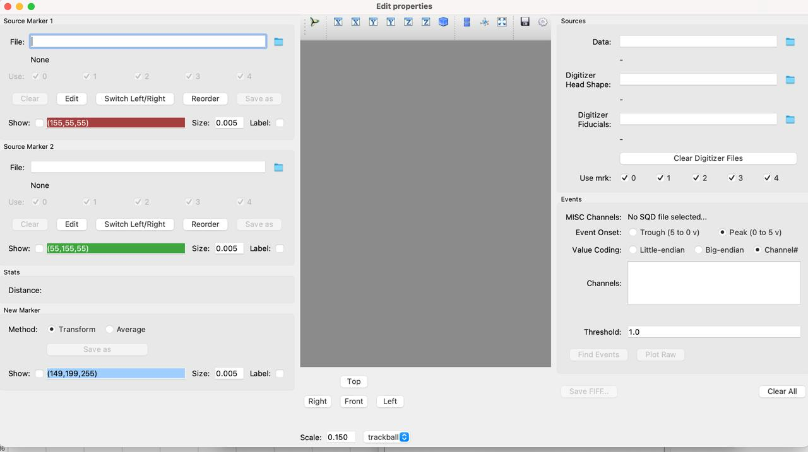
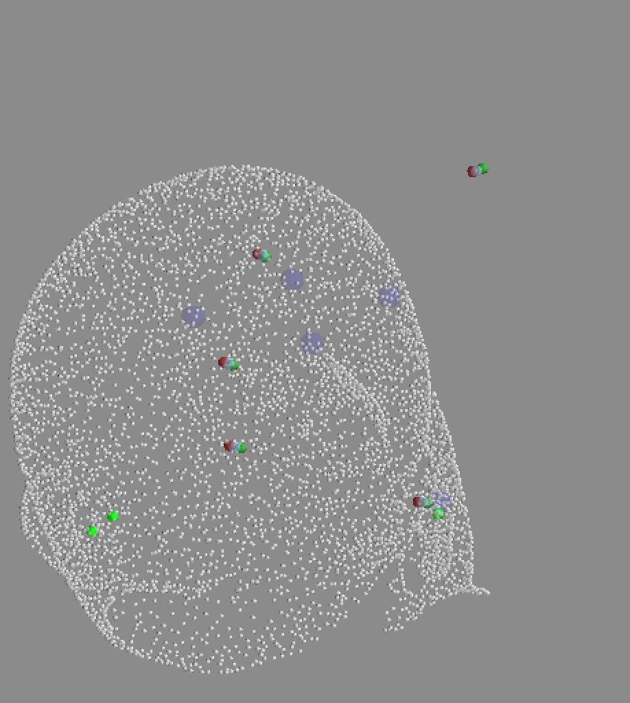
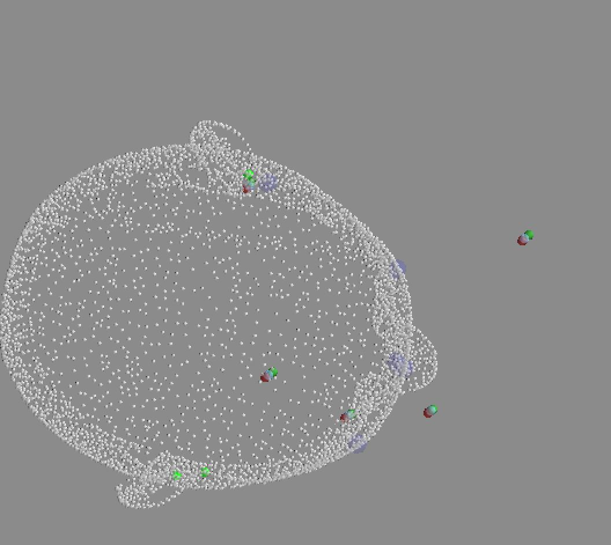
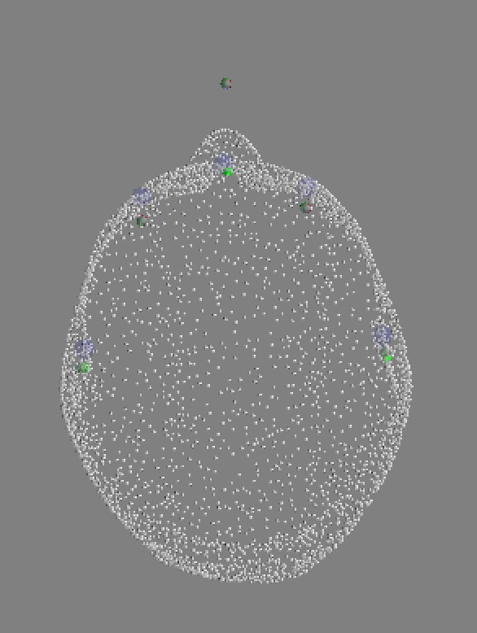
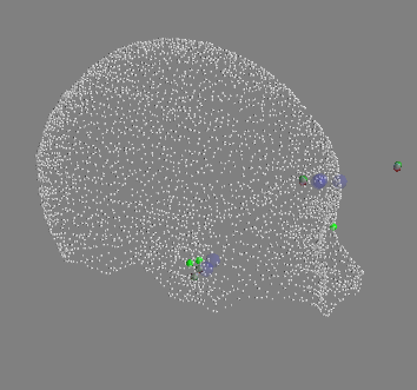
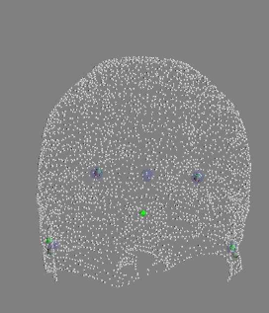
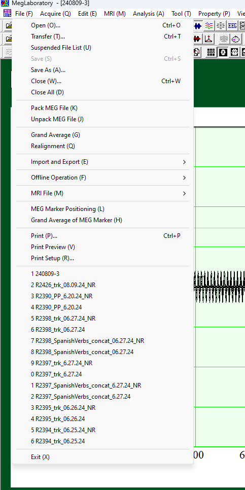
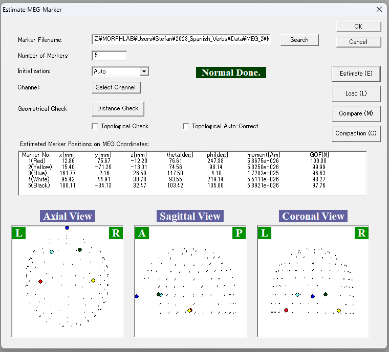
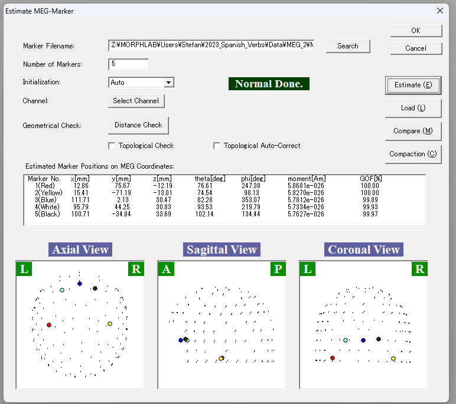

# Kit2fiff

## Overview

Once you have your noise reduced files, you need to convert your data and marker measurements into a single file that can be read and manipulated by MNE Python.

Files needed:
- Pre-experiment marker positions (marker 1)
- Post-experiment marker positions (marker 2)
- Experimental (MEG) data
- Head scan (from FastScan)
- Marker measurements (from FastScan)

## Step-by-step procedure

Activate a conda environment with the relevant packages. Note that the kit2fiff command doesn't work with all versions of MNE; if this is the case in your environment, you can create a separate environment with MNE version 0.15.2, which has functioning GUIs.

1. Execute the following command to open the kit2fiff GUI:

```
mne kit2fiff
```



2. In a Finder window, navigate to the folder containing your raw data for a given subject. Then, copy the file pathname (on Mac, hold 'control', click a file, press 'option', and click 'Copy file as pathname') for the following files and insert them into the appropriate fields:

- Source Marker 1 (typically named 'R#_experiment-1.mrk'): File that has the marker measurements from inside the MEG scanner before the start of the recording of the data you are analyzing.
- Source Marker 2 (typically named 'R#_experiment-2.mrk'): File that has the marker measurements from inside the MEG scanner after the end of the recording of the data you are analyzing.
- Data (typically has the name 'R#_experiment_NR.sqd'): File containing the MEG recording of the data you are analyzing.
- Digitizer Head Shape (typically has the name 'R#_experiment_HS.txt'): File containing coordinates of the head scan of your participant from FastScan. This should be the coordinates after you have generated a basic surface of the scan (done in the MEG lab).
- Digitizer Fiducials (typically has the name 'R#_experiment_points.txt'): File containing x, y, and z coordinates of the 5 marker measurements from FastScan.

3. After you load all 5 files into the GUI, all marker measurements will appear on the interface. You must now check that the marker measurements from the MEG scan (presented in blue/green and red) align with the marker measurements (green, the only file also containing fiducials) and headshape measurements from FastScan. In most cases they will. In case they don’t, see the Troubleshooting section. Additionally, take note of the distance between the two markers (given beneath the fields for uploading the two marker files). Did the participant move a lot? If so, the distance between the two markers will be large. While there is no hard and fast rule for when to exclude a participant due to excessive movement, it is worth considering excluding a participant if they moved a lot compared to other participants.

Click on 'Find Events'. The pop up window should show you your trigger schema with the correct number of trials per condition.

Important: If you do not see the number of triggers you expected, one (or more) trigger wasn't recorded. As such, you have to do some digging to figure out which one(s) is missing. This can be done by matching the trigger schema of your events (more on this later) with your logfile. If you're only missing one trigger, it is often the first trigger since the trigger box has to 'warm up'. A way to address this for the next participant is to add a dummy trigger at the beginning of your presentation script, which may or may not be recorded in the MEG recording. In cases where the dummy trigger is recorded, it will be discarded when epoching the data.

4. If everything looks correct, click `Save FIFF` and save the fif-file as 'R#_experiment-raw.fif' to an appropriate location.

This process should be repeated for each participant and each separate recording. If your experiment has multiple parts (e.g. a main and localizer task) or if you took multiple recordings (because the participant had to take surprise breaks and get up, or your experiment has multiple recording sessions), this process should be done separately for each recording.

In some cases, you might want to concatenate your fif-files to one combined fif-file, e.g., if you see radio bursts or your experiment is long and you split your recording into multiple recordings. An advantage of splitting your recording into multiple recordings is that you would then only lose part of a recording in case your sensors become saturated (the sensors typically reset when you reinitialize a recording). Concatenation of fif-files can be done using the following lines of code:

1. Load in each fif-file in separate variables:
```
fif1 = mne.io.read_raw_fif('[path/to/fif-file]')
```
2. Concatenate fif-files:
```
fifs = mne.concatenate_raws([fif1, fif2, fif3])
```
3. Save concatenated fif-file:
```
fifs.save('[path]/R#_experiment-raw.fif')
```

Note that certain versions of MNE will yield error messages if you try to concatenate fif-files created with different marker measurements. If you are confident that your participant didn't move between the two recordings—or at least didn't move more than what is to be expected throughout a regular experimental session—simply use the same marker measurements for all fif-files.

## Details about the GUI
The GUI has the following things that you can edit as needed:

- (MEG) markers section:
    - Edit: Edit the coordinate points of any of the five markers
    - Switch Left/Right: Flip the coordinates (Used when??)
    - Reorder: Reorder the coordinates (used if you placed the markers on the participant’s forehead in the incorrect order)
- Center window:
    - You can add an x-y-z axis guide which is super helpful in orienting yourself
    - Top/Right/Front/Left: Position the scan in a certain way
- Sources:
    - Use Mrk: Deselecting a specific marker excludes that marker from the estimation. This is helpful if the FastScan of a specific marker is incorrect
- Events: This section is dedicated to the event triggers you send
    - Small-Endian/ Big-Endian: Triggers are encoded in a binary schema (see below for explanation)
    - Channel#: Each individual trigger is sent to separate channel.
    - Trough vs. Peak: Is your trigger defined by a drop in signal (trough) or a spike in the signal (peak)? Our standard lab practice (and the way most scripts are set up) send a trigger peak, thus you should select Peak.
    - Value Coding: How are you encoding your triggers based on which channels they are sent to. In this lab we usually use Big-Endian.


## Troubleshooting

### Markers are good relative to each other but don't align with the head

It's kind of hard to see from the images, but in this case, the markers seem to be correctly aligned with each other but not to the head. It's as if they were all shifted 90 degrees.

Examples:



The issue is most likely that the FastScan of the markers is incorrect:
- You did the scan of points wrong. In this case, go to the lab computer in the MEG where you took the scan and open the original file of the scan. You will have the order of the point markers that you took. Check to make sure that you took the measurements in the correct order and that you don't have any extra (more than 5) markers.
- If you have extra markers, deselect them. Then export the file.
- If you took the scans in the incorrect order, you can either go to the output file that you have already exported, and simply switch the coordinate rows in the text file.
- Placement of markers on participant's head is incorrect: You put the markers on the person's head in the incorrect order. While you can fix this in the kit2fiff GUI, you have to know what markers you put where, otherwise it's really hard to reconstruct what you did wrong. In that case either throw out the data or ask Jeff for help.
- If you do know the mistake you made, you can edit the marker positions in the kit2fiff GUI's (MEG) Markers Section, using the Edit, Switch, and Reorder functions described above.


## One of the markers is way off, the other ones seem ok
It would look something like this, note the middle marker seems to be outside of the head whereas all of the other ones seem ok.





This happens when the markers are estimated incorrectly (when taking marker measurements in the MEG and the program gives you that yellow warning). In order to fix these, head over to lab computer that has MEGLAB installed on it. Open your marker measurement file. Go to *file > MEG Marker Position (L)*.



Click on *Load* and open your marker measurement file again (I'm kind of unsure why we have to open it twice, and something weird happens with saving, so if you find a better way to do this, lmk). Click *Estimate*. You should immediately see the issue that you saw when doing kit2fiff in the little gui:



In order to fix the issue, click *Select Channel*. The following screen will pop up:


Here you see all of the channels that are selected. Click the *Toggle Mode* and toggle a channel, click *ok*, then re-estimate the markers. Continue doing so until you find a combination of channels for which the marker is correctly estimated. Note, it is usually either channel 14 (i.e., channel 15) or channel 78 (i.e., channel 79). Afterwards the little gui should give you normal looking markers:




After you are done, click *File > Save As*. Note that the saving is super weird. I think what happens is that it saves the toggle settings on the file that you uploaded in the mini gui, but not the main file. So that the "Saved As" file ends up being the original file, where as the file with the original name ends up having the toggled and corrected features. IDK, when loading the markers back in just play around with it, something should work.
