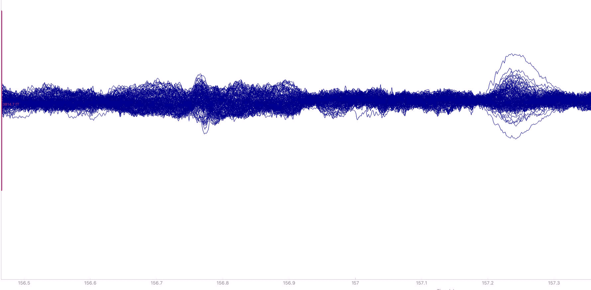
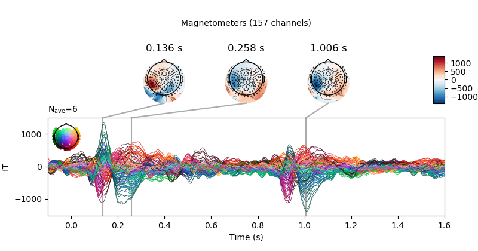
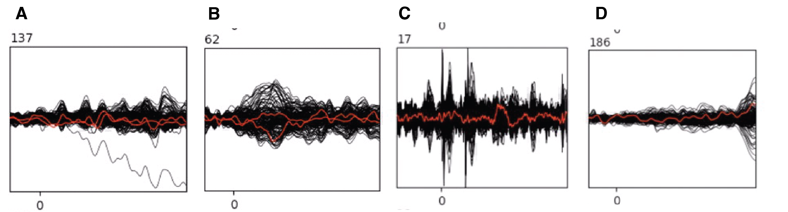

# Epoching

## Epochs: What are they, and what might we use them for?
The MEG recording is one long recording of continuous data; that is, it captures both the data of interest—a participant’s response to the stimuli—as well as everything in between such as breaks between trials, breaks between blocks, and any pre- and post-experiment setup logistics. We only care about the participant’s response to the stimuli, and therefore crop the continuous data into smaller segments, which we call **epochs**.

Epochs are time-locked to events of interest. If you have a factorial design, you will typically extract information from briefly before stimulus onset until well after the stimulus has disappeared. It is also possible to extracts epochs from the continuous recording if you use naturalistic stimuli such as listening to an audiobook as long as you can reliably align the stimulus and the MEG recording.

Examining one epoch is unlikely to tell you much about how your stimulus is processed; there is simply too much noise in the neural data. However, averaging many epochs together enhances the signal-to-noise ratio and allows us to study **event-related fields (ERF)** (‘fields’ since we use MEG, in EEG research the equivalent is **‘event related potentials’ (ERP)**).

ERFs/ERPs often reveal sensory components reflecting the stimulus presentation modality, with early auditory or visual activity increases around 100ms after stimulus onset, but that’s about all we can see just by eyeballing an ERF/ERP from a single subject. That’s why we need many subjects (current standard in our lab is 30-35 participants) to get a sufficiently good signal-to-noise ratio to identify more subtle components associated with cognitive processing.

*Individual epoch*

*ERF*

## Experimental design considerations
While it’s difficult to determine the exact number of trials per condition needed, a good rule-of-thumb is to have at least 50 trials per condition. If you suspect that your experimental manipulation might be on the more subtle side, it’s a good idea to increase the number of trials per condition.

When designing your experiment, you need to strike a balance between having enough trials per condition (to have a sufficient signal-to-noise ratio) but also not overwhelming your participant. The longer your study, the less engaged your participant is likely to be due to fatigue and boredom, which will likely give you worse data. As such, while it can be tempting to include many manipulations in one experimental setting, an unrealistically high number of factors and levels within each factor will result in a high total number of trials.

Say, for example, that you want to have 50 trials per condition. If your design is a simple 2 x 2 x 3 factorial design, it will have 12 conditions (2 * 2 * 3), which produces a total of 600 trials for the experiment. If each trial takes approx. 2.5s, the participant will spend roughly 25min completing the experiment. Say now that you decide to add an additional condition with 2 levels—this increases the number of conditions to 24, and the experiment would now take 50min to complete. There is thus quite a difference in the length of the experiment, and this is with “just” 50 trials per condition.

What if your experimental design does not allow you to construct, e.g., 50 distinct trials per condition? One potential solution can be to repeat individual stimuli to get enough trials per condition. If so, make sure to have the same number of repetitions across conditions  (i.e., if each stimulus is repeated twice in condition A, each stimulus should also be repeated twice in condition B). If you do repeat your stimuli, make sure that your stimuli are pseudorandomized (rather than fully randomized) so that identical stimuli occur in different blocks.

## Defining epochs
How do we determine the length of an epoch? For factorial designs, epochs typically include:
-	A baseline period (in our lab often the 100ms before stimulus onset)
-	The time of stimulus presentation (depends on your specific experiment)
-	Oftentimes a period post-stimulus presentation (depends on your specific experiment)
-	Potentially the task stimulus

Why do we need a **baseline** period? A baseline period is a period of time where no activity of interest, i.e., activity related to your experimental manipulations, is presumed to be present. Naturally, however, there will still be neural activity even though no stimulus is presented, and it is this background activity that we want to attenuate. This can be done by baseline correction, which typically involves subtracting the mean amplitude across the baseline period from the entire epoch.

For example, your trial structure might be as follows (current trial structure of many RPVP studies in the lab):
1.	Fixation cross (-400-200ms pre-stimulus onset)
2.	Blank screen (-200-0ms pre-stimulus onset)
3.	Trial stimulus (0-300ms post-stimulus onset)
4.	Blank screen (300-800ms post-stimulus onset)
5.	Task stimulus (800-1100ms post-stimulus onset)
6.  Blank screen until button press
7.	Jitter (duration: 600-750ms)

In this example, you could extract epochs from -100ms to 800ms to capture only processing of the stimulus (+ a baseline period from -100-0ms). You could also extract longer epochs if you are interested in the processing of the task stimulus in addition to the trial stimulus. If so, you want to make sure to trim your epochs so they do not contain a motor response from the button press, but remember that this will vary from subject to subject.

Epochs in factorial designs typically do not overlap. This is different from epochs extracted from naturalistic stimuli like audiobooks where (parts of) the epoch—whether they be segmented at the phoneme-, word-, or sentence-level—typically overlap somewhat. As such, it is not straightforward to use the pre-stimulus period as a baseline as the segment prior to the stimulus of interest is likely to contain activity other than background activity and/or resting state activity. The remainder of this section will focus on factorial designs as naturalistic designs require experiment-specific considerations.

## Creating epochs in MNE
In order to actually create epochs, we need to know when each stimulus is presented. We do this by sending triggers on our trigger channels (channels 160-166) in the MEG. Making sure that your presentation script actually sends triggers is therefore an important thing to check while piloting your experiment!

In MNE, epoching is done on a Raw object, which has preferably been filtered (if you wish to apply a filter) and with bad channels interpolated. The basic procedure for creating epochs is as follows:

1.	Read in the Raw object:

``raw = mne.io.read_raw_fif(‘path/to/your/raw/object’, preload = True)``

2.	Create a dictionary of event ids (i.e., your conditions!):

``event_id = {‘conditionA’: 1, ‘conditionB’: 2}``

If you didn't create an informative trigger scheme or have more conditions than there are triggers, you can also create this dictionary based on your logfile. The exact implementation of this will depend on your experiment.

3.	Identify events:

``events = mne.find_events(raw, min_duration=0.002)``

Here, min_duration helps you identify triggers sent to the MEG.

4.	Pick only the MEG channels to create epochs:

``picks_meg = mne.pick_types(raw.info, meg=True, eeg=False, eog=False, stim=False)``

5.	Create epochs:

``epochs = mne.Epochs(raw, events, event_id = event_id, tmin=-0.1, tmax=0.8)``

Here tmin and tmax are, respectively, the beginning and end of your epochs.

6. Check that you have the expected number of epochs based on the number of trials. If you do not see the number of epochs you expected, one (or more) trigger wasn't recorded and epochs therefore not created. As such, you have to do some digging to figure out which one(s) is missing. This can be done by matching the trigger schema of your events with your logfile.

If you're only missing one epoch, it is often because the first trigger wasn't recorded since the trigger box has to 'warm up'. A way to address this for the next participant is to add a dummy trigger at the beginning of your presentation script, which may or may not be recorded in the MEG recording. In cases where the dummy trigger is recorded, it will be discarded when epoching the data.

7. Align your logfile to your epochs:

``epochs.metadata = logfile``

It is also possible to assign the logfile directly to the metadata-attribute during epoch creation, but if you need to delete trials in your logfiles due to unrecorded triggers, it's easier to simply align the epochs and logfile after doing so.

8. If you wish, you can plot the evoked response to see a visual 'summary' of the data:

``evoked = epochs.average()
fig_evo = evoked.plot_joint()``

## Things to consider when creating epochs
The above steps are the bare minimum required to create epochs; however, there are various parameters that you may consider when creating epochs.

For example, do you want to do ICA before or after epoching your data? One argument in favor of doing ICA before epoching your data include, among others, that more and continuous data will improve the estimation of independent components and increase the likelihood of separating artefacts like eye blinks, heartbeats, and muscle activity from the neural signal. An argument in favor of doing ICA after epoching your data is that you only supply the algorithm neural data that actually occur within the time window of interest, thus reducing the impact of “noise” from breaks and jitter periods in the ICA algorithm, in addition to it being computationally more efficient.

Another important thing to consider is when you want to do baseline correction. By default, baseline correction will be done when epoching your data and defined as the time span from tmin to 0, but you have the option of customizing the baseline period with the baseline parameter (e.g., changing the beginning and end of the baseline or simply prevent your epochs from being baseline corrected).

## Epoch rejection

Even after filtering and ICA, some epochs might still contain too much noise to be part of the statistical analysis. This could, for example, be due to environmental noise such as radio bursts saturating the sensors (which we, unfortunately, often experience at our NYC recording site). As such, we want to reject epochs if they are too noisy. There are two approaches to this.

One approach is to simply automatically reject all epochs based on maximum peak-to-peak signal amplitude (i.e., the absolute difference between the lowest and highest signal value, calculated per channel) using the following piece of code:

``reject = {'mag': 3e-12} # default value used for our NYC recording site
epochs.drop_bad(reject)``

Some people prefer this approach as it is not subject to individual researcher subjectivity; rather, epochs are dropped using an objective criterion.

However, other people prefer to also click through all epochs and remove epochs that exhibit unusual activity based on visual inspection. This could be one channel going rogue (A), an epoch with more overall noise than most other epochs (B), or if an epoch contains crazy spikes (C) or has a sudden change (D). While manual epoch rejection undoubtedly introduces some bias in which epochs are retained and which are rejected, automatic threshold rejection has the potential confound that epochs which are objectively different from other epochs (see examples below) may be kept simply because they do not exceed the maximum peak-to-peak signal amplitude, even if they are very close to the threshold. Needless to say, the researcher should not know what experimental condition an epoch belongs to when doing manual epoch rejection.  

One way to manually inspect and reject epochs is through the Eelbrain GUI. The steps to doing so are as follows (be sure that you use an environment without MNE Python):

1.	Read in your epochs object:

``epochs = mne.read_epochs('path/to/your/epochs/object’)``

2.	Open the Eelbrain GUI by running:
``eelbrain.gui.select_epochs(epochs, vlim=3e-12)
eelbrain.gui.run(block=True)``

3.	Click through the epochs and click on the ones that you wish to reject. A rejected epoch will have a big red cross on them.

4.	Once you have selected all the epochs you want to reject, click the 'Save As' button (second from top left, between the greyed-out save button and the folder button). Save as ‘R#_experiment_rejfile.pickled’ and change the file type to .pickled in the bottom of the window!

5.	Load in the pickled file with rejected epochs:

``rejfile = eelbrain.load.unpickle(‘path/to/your/rejfile.pickle’)``

6.	Run the following piece of code to reject the identified epochs and save the remaining epochs:

``good = rejfile['accept'].x
epochs_good = epochs[good]
epochs_good.save(‘path/to/your/saved/epochs’)``

## Other reasons to reject epochs

At this point, you have epoched your data and it should be relatively clean. What might be other reasons to remove certain epochs from your analysis?

If you have a factorial design, chances are that you will run a repeated measures ANOVA (rmANOVA) on the aggregated dataset from all subjects. While rmANOVAs don’t require a strictly balanced design, i.e., with an equal number of trials per conditions, a balanced design is ideal for simplicity and statistical power. One way to ensure a balanced design is to equalize the number of trials per condition for each subject. This is straightforwardly done with the following piece of code:

``epochs, eq_ids = epochs.equalize_event_counts(event_ids=event_id)``

Which epochs are removed is determined by the following (from MNE Python: https://mne.tools/stable/generated/mne.Epochs.html#mne.Epochs.equalize_event_counts)

'Equalize the number of trials in each condition. It tries to make the remaining epochs occurring as close as possible in time. This method works based on the idea that if there happened to be some time-varying (like on the scale of minutes) noise characteristics during a recording, they could be compensated for (to some extent) in the equalization process. This method thus seeks to reduce any of those effects by minimizing the differences in the times of the events within a Epochs instance. For example, if one event type occurred at time points [1, 2, 3, 4, 120, 121] and the another one at [3.5, 4.5, 120.5, 121.5], this method would remove the events at times [1, 2] for the first event type – and not the events at times [120, 121].'

Naturally, you can also remove epochs on other grounds, e.g., incorrect responses on task stimulus or responses times more than 3 SDs from participant and/or item means. This will not be appropriate to do in all cases though so consider your justification for doing so. These kinds of epoch rejections are done using the information stored in epochs.metadata.

## Additional resources:
Overview of the epoching process from MNE Python:
https://mne.tools/stable/auto_tutorials/epochs/10_epochs_overview.html
